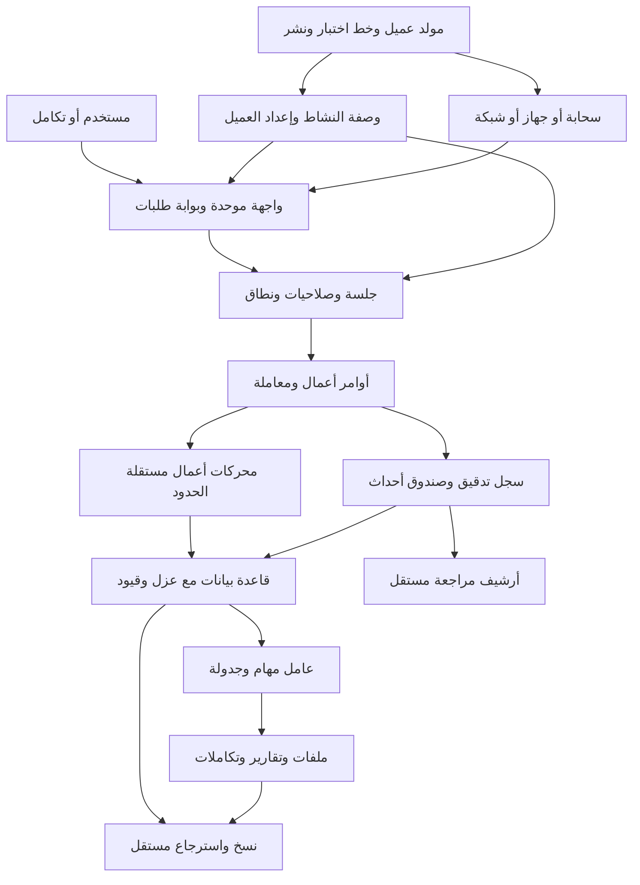

# 🏭 الخطة الرئيسية لمصنع أنظمة الأعمال

**تصميم المنتج والمنصة والأمن والتشغيل — الإصدار الأول — ٢٥ سبتمبر ٢٠٢٦**

هذه وثيقة تأسيس قبل التنفيذ، مبنية على المتطلبات المرفقة ومراجعة توثيق رسمي ومشروعات مفتوحة المصدر. لم يتم بناء النظام أو اختبار أدائه. أرقام المدة والسعة والتكلفة التشغيلية المقترحة فرضيات تخطيط، وأسعار المزودين المشار إليها لقطة وقت البحث وليست عرض سعر ملزمًا.

**الفكرة في سطر:** نبني منتجًا أساسيًا واحدًا، ومحركات لها قواعد واضحة، ووصفات نشاط وإعدادات عميل؛ فينشأ نظام العميل من تركيب مُختبر، وتظل ترقيته ممكنة من نفس المصدر.

هذه المنصة أوسع من منصة تخطيط المساحات في الوثيقة السابقة. العلاقة الصحيحة أن مخطط المساحات يمكن أن يصبح منتجًا أو محركًا متخصصًا يتكامل معها لاحقًا؛ لا نحشر هندسة المجسمات داخل نواة المحاسبة والصلاحيات.

لصاحب المشروع: اقرأ الأقسام ١ و٢ و٢٦ و٢٨ و٢٩ و٣٠. ولمن سينفذ: عقود الصلاحيات والتسجيل والمعاملات والترحيل ليست اقتراحات شكلية، بل شروط قبول لكل وحدة.

## 1. نقد الفكرة والمخاطر التي لا نراها 🔎

الفكرة قابلة للتنفيذ، لكن أخطر تفسير لها هو: «نعمل جدولًا عامًا وشوية شاشات، والذكاء الاصطناعي يحولها لأي نشاط». ذلك ينجح في عرض أولي ثم ينهار أمام الفواتير والمرتجعات والصلاحيات والتسويات والترقيات. **المتشابه بين الأنظمة كبير في البنية، وأقل بكثير في قواعد العمل الحساسة.**

### التصحيحات الأساسية

| الافتراض | المشكلة الخفية | التصحيح |
|---|---|---|
| لا شيء يتم حذفه مطلقًا | تكلفة غير محدودة واحتفاظ غير لازم ببيانات حساسة | لا حذف نهائي للمستخدم العادي؛ احتفاظ محدد وإتلاف مُراجع عند استحقاقه |
| تسجيل كل ضغطة يثبت الحقيقة | المتصفح قد يتعطل أو يرسل أحداثًا مزيفة | سجل الخادم هو دليل العمل؛ التفاعل قرينة مساعدة |
| محرك واحد للأموال والمخزون والمبيعات | تداخل مصادر الحقيقة ودورات حياة مختلفة | وحدات مستقلة تتعاون داخل معاملة عند الحاجة |
| مربعات اختيار تكفي للصلاحيات | النطاق والاستثناء والمنع أهم من الزر | واجهة بسيطة فوق سياسات واضحة ومحاكاة للنتيجة |
| العمل دون إنترنت مجرد حفظ في المتصفح | تعارض مخزون وأرقام فواتير وصلاحيات قديمة | نبدأ بخادم محلي موثوق؛ المزامنة المتعددة مشروع مستقل |
| لا يمكن تسريب شركة أخرى مطلقًا | مدير قاعدة قوي أو اختراق خادم قد يتجاوز بعض الطبقات | دفاع متعدد واختبارات؛ عزل مستقل عندما يتطلب نموذج الخطر |
| توليد نظام عميل يعني نسخ مشروع | تتضاعف صيانة العيوب والترقيات | التوليد ينتج إعدادات وتوزيعة وملفات نشر، لا فرعًا مختلفًا من النواة |
| كل الأنشطة مجرد وصفات | الرواتب والصيدلة والمحاسبة تحتاج معرفة ومراجعة تخصصية | وصفة تعيد استخدام قدرات موجودة؛ القدرة الجديدة تُبنى وتُختبر فعلًا |

**متى لا نبني منصة جديدة؟** لو الهدف أولًا بيع نظام محاسبي شامل خلال أسابيع، تخصيص نظام مؤسسي قائم قد يكون أقل مخاطرة من كتابة دفتر أستاذ ورواتب وضرائب من الصفر. أما لو الهدف طويل المدى منتجات أخف وتجربة موحدة وتشغيل مرن يملك فريقك تطويره، فالنواة المقترحة مناسبة بشرط أول منتج محدود.

### ماذا نتعلم من المشروعات المذكورة؟

المقارنة التالية مبنية على التوثيق والمستودعات الرسمية، وليست تدقيقًا أمنيًا لشيفراتها أو شهادة بأن أي مشروع يغطي شروطنا بالكامل.

| المشروع | الممارسة المفيدة | ما سنأخذه | ما لن نفترضه |
|---|---|---|---|
| إيه آر بي نكست وإطار فرابي | تعريف المستندات والصلاحيات ونقاط التمديد؛ قيود مستقرة بعد الترحيل | عقود مستندات وإضافات وحركات عكسية | أن كل دورة حسابية مناسبة تلقائيًا لكل عميل [م١، م٢] |
| أودو | وحدات أعمال وحقوق على النماذج وقواعد سجلات | استقلال الوحدات وربط العملية بالنطاق | دلالة السماح الافتراضي لبعض قواعد السجلات لا تناسب طلبنا؛ نختار المنع الافتراضي صراحة [م٣] |
| دايركتس | سياسات وصول وحقول وواجهة إدارة مبنية على تعريفات | توليد إدارة موحدة من وصف مضبوط | إدارة بيانات عامة ليست محرك محاسبة؛ وشروط الترخيص تُراجع قبل إعادة الاستخدام [م٤] |
| توينتي | تخصيص كيانات وحقول وصلاحيات داخل منتج عملاء | تجربة تخصيص منظمة وأدوار وحقول حساسة | التخصيص لا يجعل الكيانات الطبية والمالية متكافئة [م٥] |
| ميدوسا | وحدات تجارة وسير عمليات وتعويض خطوات | وحدات تملك بياناتها وتنسيق تكاملات قابل للاستئناف | التعويض بين أنظمة لا يساوي معاملة قاعدة واحدة [م٦] |
| قوالب المنصات متعددة العملاء | نطاقات وعلامة وإعداد عميل | تسريع التهيئة والتوجيه | نطاق فرعي واشتراك لا يثبتان عزل ملفات أو مالية أو تدقيقًا مؤسسيًا [م٧] |

**القرار:** نقتبس الأنماط ونستخدم المكتبات المناسبة بعد مراجعتها، ولا ندمج هذه المشروعات كلها في منتج واحد. لكل مكتبة أو جزء مُعاد استخدامه سجل إصدار ورخصة وحقوق توزيع. تعلم الفكرة مختلف عن نسخ الشيفرة.

أكبر تكلفة مخفية ستكون البيانات القديمة، وتجهيز الأدوار، وتنظيف ملفات العميل، ودعم الطباعة، والترقية، والاسترجاع؛ ليست رسم الشاشات فقط. لذلك نبيع «تركيبًا قياسيًا + خدمات انتقال واضحة»، ولا نعد بتسليم أي نشاط في يوم واحد.

## 2. القرارات المعمارية الأساسية المقترحة 🧭

**الاختيار الرئيسي:** تطبيق خادم واحد منظم إلى وحدات، وقاعدة علائقية، وعامل مهام خلفي من نفس المستودع، وواجهة موحدة. نفصل خدمات إضافية عندما يوجد سبب تشغيل مثبت، وليس لأن العدد الكبير للخدمات يبدو أكثر تقدمًا.

| القرار | البديل | الميزة | العيب | لماذا نختاره ومتى نغيره؟ |
|---|---|---|---|---|---|
| خادم منظم إلى وحدات | خدمات صغيرة مستقلة | معاملات أسهل وتشغيل أقل | يحتاج ضبط حدود داخلي | نبدأ به؛ نفصل عاملًا أو وحدة إذا اختلف حملها أو دورة نشرها بوضوح |
| قاعدة علائقية واحدة النوع | قاعدة خفيفة محليًا وأخرى سحابيًا | نفس القيود والعزل والاختبارات | حزمة محلية أكبر | سلامة الأعمال أهم من فرق حجم التثبيت؛ لا نضيف محركًا ثانيًا بلا طلب قوي |
| واجهات أوامر أعمال | تعديل جداول مباشرة من المتصفح | تفويض ومعاملة وسجل موحد | تطوير واجهات إضافية | لازم للعمليات الحساسة؛ القراءة المحدودة يمكن تحسينها لاحقًا |
| سجل تدقيق مع جداول تقليدية | تخزين أحداث لكل النظام | فهم واستعادة واستعلام أبسط | لا يعيد تشغيل كل التاريخ آليًا | يكفي غالبًا؛ دفاتر المال والمخزون سجلات حركات متخصصة |
| وصفة وإعدادات عميل | نسخ مستودع لكل عميل | إصلاح وترقية مرة واحدة | أقل حرية لتعديلات عشوائية | مناسب لشركة منتج؛ الحالات المختلفة جذريًا تُسعّر كمنتج مستقل |
| صلاحيات أدوار مع شروط نطاق | أدوار فقط أو سياسة حرة بالكامل | توازن سهولة ودقة | يلزم شرح سبب القرار | الشروط تبدأ محدودة وقابلة للترجمة لقاعدة البيانات |
| بيانات معلنة مع شيفرة أعمال مكتوبة | مولد بلا شيفرة لكل شيء | تنظيم دون إضعاف المحاسبة | لا يلغي عمل المطور | التوليد للهيكل؛ قواعد الحساب والاعتماد تُراجع يدويًا |
| خادم محلي عند غياب الإنترنت | مزامنة كاملة لكل الأجهزة | اتساق قوي وتكلفة أقل | يحتاج جهازًا يعمل | نضيف المزامنة اللامركزية لنشاط يثبت عائدها فقط |

### الحزمة التقنية المقترحة

الأسماء التقنية منفصلة عن الشرح، وهي اختيار مبدئي يثبت بمرحلة إثبات توافق؛ ليست قائمة مشتريات ولا إلزامًا بآخر نسخة.

| المكوّن | الاختيار | دوره |
|---|---|---|
| لغة مشتركة | TypeScript | عقود وواجهة وخادم ومولد |
| واجهة | React + Vite | تطبيق أعمال متصفح يسهل تقديمه سحابيًا ومحليًا |
| موقع تسويقي اختياري | Next.js | منفصل عن منطق الأعمال؛ لا نحتاجه لفرض الصلاحيات |
| خادم | Node.js LTS + Fastify | طلبات وجلسات وتنسيق أوامر |
| قاعدة | PostgreSQL | معاملات وعزل وقيود وفهارس |
| استعلام وترحيل | Kysely + versioned SQL migrations | وضوح الاستعلام وعدم إخفاء سياسات القاعدة |
| تحقق | JSON Schema + Ajv | تعريف موحد يمكن التحقق منه وتوليد أنواع منه |
| هوية أولية | Better Auth behind IdentityPort | جلسات مُدارة بمكتبة موجودة؛ تفويض الأعمال مستقل عنها |
| دخول الشركات | OIDC adapter | التكامل مع مزود العميل دون استبدال نموذج الصلاحيات |
| مهام | pg-boss + PostgreSQL | بدء بطابور دون خادم إضافي |
| ملفات | ObjectStoragePort: S3 or local filesystem | نسخة ثابتة لكل رفع، بعزل وصلاحيات |
| جداول وبيانات واجهة | TanStack Table + TanStack Query | جداول موحدة وطلبات؛ لا صلاحيات موثوقة في المتصفح |
| معالجة ضخمة | Python worker + streaming readers + native DuckDB | تحليل ملفات وحسابات خارج مسار الطلب القصير |
| معالجة محلية اختيارية | DuckDB-Wasm in Web Worker | تحليل ومعاينة على الجهاز ضمن حدود واضحة |
| اختبارات | Vitest + Playwright + PostgreSQL integration tests | فحص القواعد والواجهة والقاعدة الحقيقية |
| مراقبة | OpenTelemetry + structured logs + metrics | نقل الرصد لأي مزود أو بيئة داخلية |
| نشر | OCI containers + Compose | نفس التطبيق ومحولاته عبر البيئات |
| مستودع | pnpm workspaces | حزم مشتركة دون نسخ بين العملاء |

لا نبني خوارزمية كلمات مرور أو إدارة جلسات من الصفر. المكتبة المختارة توفر إدارة جلسات وإبطالها، لكن صلاحيات الفروع والرواتب والتصدير من منتجنا وتُفحص في كل عملية. نراجع إصدار المكتبة وثغراته وتوافق تشغيله قبل اعتماده. [م٨]

**عقد معماري ثابت:** لا معرفة بالمزود السحابي داخل محركات الأعمال؛ لا استيراد ملفات داخلية من محرك آخر؛ لا وصول متصفح للجداول الحساسة؛ لا كتابة عمل مهم خارج مسار معاملات وتدقيق.

## 3. الرسم المعماري الكامل 🏗️



القاعدة والسجل وصندوق الأحداث في نفس المعاملة للعملية الواحدة. الأرشفة والرسائل والتكاملات الخارجية بعد نجاحها، عبر عامل يعيد المحاولة دون تكرار أثر الأعمال. الرسم يوضح المسار الوظيفي؛ قواعد الاستيراد البرمجي أضيق منه.

مستويان للإدارة: **إدارة المنصة** تعرف العملاء والإصدارات والاشتراكات والصحة التشغيلية، و**بيانات العميل** تعرف مبيعاته وموظفيه وملفاته. إدارة المنصة لا تمنح صاحبها حق تصفح كل أعمال العملاء يوميًا؛ الوصول للدعم له سبب ومدة وصلاحية وسجل.

## 4. تقسيم النواة ومحركات الأعمال 🧩

النواة تقدم وسائل مشتركة، ولا تعرف معنى فاتورة أو جرعة دواء أو أمر تصنيع. كل محرك يملك كياناته وقواعده ومخازن بياناته وتقاريره، ويعرض عقدًا يتعامل معه الآخرون.

### النواة المشتركة

| الوحدة | ما تملكه | ما لا تملكه |
|---|---|---|
| العميل والمنشأة | شركة مستأجرة وكيانات قانونية وفروع وفرق وإعدادات | أرصدة حسابات وحركات مخزون |
| الهوية والصلاحيات | عضويات وأدوار وسياسات وجلسات وتفويض | منطق اعتماد فاتورة بعينها |
| سجل العمليات | سياق حدث ومصدر وترابط وحماية | تفسير حسابات دفتر الأستاذ |
| الملفات | ملكية وإصدارات وصلاحيات وحجر | معنى المستند الطبي أو عقد المورد |
| الوظائف والتكامل | طوابير وجدولة وصندوق إرسال ومفاتيح تكرار | قواعد خصم مخزون أو استحقاق مرتب |
| الاستيراد والتصدير | قراءة ومطابقة ومراحل ومعاينة | قبول حركة أعمال مخالفة لقيود محركها |
| سير الموافقات | حالات وانتقالات ومهام واعتمادات | تغيير قيد مالي مُرحّل مباشرة |
| واجهة وهوية | مكونات وموضوعات وترجمة وتنقل | صفحة مختلفة بلا حدود لكل عميل |
| تركيب وترخيص | محركات ووصفات واستحقاقات وتوافق | منع المستخدم من تصدير بياناته عند المغادرة |

### تقسيم المحركات المقترح

| المحرك | الكيانات الرئيسية | أهم قاعدة استقلال |
|---|---|---|
| الأطراف والكتالوج | عميل ومورد وجهة اتصال وصنف وخدمة ووحدة قياس | الطرف قد يكون عميلًا وموردًا؛ الملف الطبي أو الوظيفي منفصل |
| المبيعات والتحصيل | عرض وطلب وفاتورة تجارية ومرتجع وتحصيل | الفاتورة ليست قيدًا محاسبيًا تلقائيًا بلا سياسة ترحيل |
| المخزون | مواقع ودفعات وأرقام مسلسلة وحجز وحركة ورصيد مشتق | لا تعديل رصيد مباشر؛ الرصيد نتيجة حركات وحجوزات |
| المشتريات | طلب وطلب شراء واستلام ومطابقة مورد | الفصل بين الاستلام والفاتورة والدفع |
| المالية | حسابات وقيود وفترات وتسويات وأسعار صرف | قيد متوازن وغير قابل للتحرير بعد الترحيل |
| الأشخاص والحضور | موظف وعقد ووردية وحضور وإجازة | الراتب في نطاق بيانات حساس مستقل |
| الرواتب | عناصر استحقاق وخصم ومسير وإقفال وتسوية | مؤجل حتى توجد قواعد بلد ومراجعة مختص |
| الاشتراكات والاستحقاق | عضوية وباقة وفترة وتجديد واستهلاك | لا نخلط اشتراك عميل المنصة بعضوية زبون نادي |
| الحجز والموارد | مورد وموعد وسعة وحجز وحالة حضور | منع تعارض مورد وفق زمن وسعة صحيحين |
| الحالات وسير العمل | طلب وشكوى وتذكرة ومسار ومسؤول | تغيير الحالة له انتقال مصرح لا حقل حر |
| الأصول والمشروعات والصيانة | أصل ومهمة وأمر صيانة وتكلفة مشروع | الأصول المشتركة لا تلغي تخصص صيانة أو مقاولات |
| الإنتاج والجودة والتتبع | قائمة مكونات وأمر تصنيع ومرحلة وفحص ونسب هالك | إصدار الوصفة الإنتاجية يتثبت عند بدء الأمر |

يمكن جمع بعض الوحدات الصغيرة في حزمة نشر واحدة أولًا، لكن تبقى ملكية قواعدها منفصلة. نقاط البيع واجهة عمل سريعة فوق البيع والمخزون والتحصيل، وليست دفترًا ثانيًا. الأساطيل امتداد أصل وصيانة مع رحلات ووقود عند وجود حاجة؛ لا نضع كل قواعد النقل في تعريف أصل عام.

المحرك لا يقرأ جدول محرك آخر مباشرة. يستدعي خدمة عامة بتمرير سياق المعاملة، أو يستهلك حدثًا بعد الحفظ. التقارير المشتركة تستخدم نموذج قراءة موثقًا، بصلاحيات مساوية للبيانات الأصلية.

## 5. تصميم قاعدة البيانات الرئيسية 🗃️

**القرار:** كيانات أعمال ذات أنواع وجداول واضحة، مع امتدادات محدودة ذات مخطط تحقق. لا جدول شامل «كيان/خاصية/قيمة» للأموال والمخزون، ولا نسخ مخطط مختلف لكل عميل في الوضع القياسي.

نفرّق بين العميل المستأجر وبين الشركة القانونية داخله. مجموعة شركات قد تكون حساب عميل واحدًا يضم شركتين قانونيتين، وكل شركة لها فروع ومخازن ودفاتر وعملة أساس. لا نستخدم كلمة «شركة» لمفهومين داخل نفس الحقل.

```text
Tenant -> LegalEntity -> Branch -> Warehouse
User -> Membership(Tenant) -> RoleAssignment(scope)
Membership -> TeamMembership / DepartmentAssignment
BusinessRecord -> LegalEntity + optional Branch + optional Warehouse
BusinessRecord -> AuditEvent / RecordVersion / FileLink
RecipeVersion -> EngineVersions -> CapabilityManifest
Deployment -> ReleaseVersion -> TenantPlacement
```

| المجموعة | أمثلة كيانات |
|---|---|
| تنظيم | عميل، كيان قانوني، فرع، مخزن، موقع، قسم، فريق، تقويم عمل |
| أمن | مستخدم، عضوية، جلسة، دور، تعيين دور، منع خاص، نطاق، إصدار سياسة، حساب تكامل |
| تعاريف | قدرة، مورد، عملية، شاشة، حقل، حدث، تقرير، وصفة، إصدار محرك |
| تدقيق | حدث أعمال، فرق حقول، رأس سلسلة، بصمة أرشيف، حدث أمني، قراءة سجل |
| ملفات | ملف منطقي، نسخة ملف، ربط بسجل، بصمة، حالة حجر، تنزيل مصرح |
| استيراد | عملية، ملف أصلي، قالب مطابقة، نسخة قواعد، صف مرحلي، خطأ، دفعة اعتماد |
| تشغيل | مهمة، محاولة، جدول زمني، رسالة صندوق إرسال، رسالة واردة، مفتاح تكرار |
| دورة سجل | مراجعة، حذف منطقي، طلب استرداد، موافقة، تعليق، استثناء |
| إدارة منتج | استحقاق، هوية، نطاق موثق، تركيب عميل، نشر، ترحيل، سياسة احتفاظ |

حقول الأساس للسجلات المعتادة: معرف ثابت، عميل، كيان قانوني عند انطباقه، نسخة سجل، إنشاء وتعديل ومصدر. حقول الفرع والمخزن لا تُضاف شكليًا لكل شيء؛ المورد المشترك قد يكون على مستوى كيان قانوني، بينما الحركة مرتبطة بمخزن محدد.

```text
RecordEnvelope:
  id, tenantId, legalEntityId?, branchId?, warehouseId?
  version, createdAt, createdBy, updatedAt, updatedBy
  sourceType, externalRef?, importJobId?

SoftDeletion:
  deletedAt, deletedBy, deletionReason, deletionOperationId

Money:
  amount: exact decimal
  currency: ISO code
  roundingPolicyVersion
```

المبالغ أعداد عشرية دقيقة، لا أعداد ثنائية تقريبية. الكمية والوزن والتحويل لها دقة مستقلة. سعر الصرف واتجاهه وتاريخه ومصدره مثبتون في المعاملة؛ لا يعاد حساب الفاتورة القديمة بسعر اليوم. التقريب يحدد هل على السطر أو المستند، وتُختبر فروق الجمع.

الوقت يُخزن عالميًا مع منطقة زمنية للفرع؛ يوم العمل وتاريخ المستند قد يختلفان عن لحظة التسجيل. نستخدم اسم المنطقة الزمنية لا فرق ساعات ثابتًا حتى تعمل تغييرات التوقيت. رقم الفاتورة تسلسل أعمال ضمن شركة قانونية ونوع وسنة، والمعرف التقني مختلف؛ الرقم المحجوز أو الملغى لا يعاد استخدامه لإخفاء تاريخ.

المفاتيح الأجنبية تحمل معرف العميل مع معرف السجل لمنع ربط مورد أو ملف بعميل آخر. القيود الفريدة للأكواد تكون في نطاق الأعمال الصحيح. الحذف المنطقي قد يسمح بإعادة الاسم، لكن أكواد مالية أو أرقام مستندات تاريخية لا تُعاد دون سياسة صريحة.

الأحداث والفهارس والذاكرة المؤقتة تحمل معرف العميل. الامتدادات داخل بيانات منظمة متحقق منها للخصائص الثانوية؛ حقل يؤثر على ضريبة أو رصيد أو صلاحية يحتاج عقدًا مكتوبًا وترحيلًا واختبارات، لا إضافته من شاشة تخصيص حرة.

## 6. تصميم تعدد الشركات 🏢

| الاختيار | الميزة | العيب | أين نستخدمه؟ |
|---|---|---|---|
| جداول مشتركة وعزل صفوف | أقل تكلفة وترحيل موحد | أثر عطل مشترك واستعادة عميل أصعب | الافتراضي للعملاء الصغار والمتوسطين المتشابهين |
| مخطط مستقل لكل عميل | فصل أسماء وجداول | ترحيلات كثيرة ومخاطر مسار بحث؛ ليس عزل موارد حقيقيًا | استثناء انتقالي أو نظام قائم؛ ليس الافتراضي |
| قاعدة مستقلة لكل عميل | نقل واسترجاع وعزل أفضل | اتصالات وتشغيل وترقيات أكثر | بيانات حساسة أو عميل كبير أو شرط تعاقدي |
| نشر مستقل كامل | عزل شبكة وموارد وإصدار تشغيلي | أعلى تكلفة تشغيل | شركات كبيرة أو شبكة داخلية أو اشتراطات خاصة |
| فرع شيفرة مستقل | حرية تعديل واسعة | يتحول لمنتج منفصل يصعب ترقيته | لا نقدمه كتخصيص قياسي |

**القرار:** نموذج هجين تديره خريطة مكان العميل. مجموعة عملاء في وحدة استضافة مشتركة، وعملاء منفصلون عند الحاجة، وكلهم بنفس العقود والمحركات وترحيلات الإصدار. عزل الموارد الحقيقي يحتاج أحيانًا خادمًا أو مثيل قاعدة مستقلًا، فقاعدة منفصلة على نفس الخادم لا تمنع تأثير ازدحامه.

الجلسة تشير لعضوية موثقة. اختيار العميل يأتي من سياق موثوق بعد التحقق، وليس من حقل يرسله المستخدم أو اسم النطاق وحده. في كل معاملة نحدد العضوية والعميل، ونمنع العمل عند غياب السياق. لا يتسرب السياق عبر اتصال مُعاد استخدامه.

**طبقة قاعدة البيانات:** عزل صفوف على الجداول التابعة للعملاء، وسياسة منع عند غياب السياق، وشروط منفصلة للقراءة وللقيمة الجديدة في الإدخال والتعديل. حساب تشغيل التطبيق ليس مالك الجداول ولا حساب ترحيل ولا يملك تجاوز العزل. مالك الجداول والحسابات القوية قد تتجاوز عزل الصفوف؛ هذا موضح في توثيق القاعدة ويجب تصميم الحسابات حوله. [م٩]

النطاق يشمل القوائم والتقارير والبحث والملفات والتصدير والمهام والذاكرة المؤقتة. لا تكفي سياسة سليمة على الفاتورة إذا أعادت شاشة البحث اسم عميل من شركة أخرى. العلاقات والرسائل الخارجية والمجلدات والمفاتيح المؤقتة تُراجع بنفس الاختبارات.

الحقول الحساسة تُفصل في جداول أو مجموعات أمان مناسبة، ولا نقول إن عزل الصفوف يخفي الأعمدة تلقائيًا. القاعدة تقيد الصفوف والحسابات والجداول الحساسة؛ الخادم يختار الحقول المسموحة ويرفض الكتابة غير المصرحة؛ الواجهة تساعد على فهم النتيجة.

**حد الثقة المعلن:** العزل يحمي من أخطاء واجهة وتغييرات معرفات ونسيان مرشح في استعلام عادي باستخدام حساب محدود. لا يقدم وعدًا ضد سيطرة كاملة على خادم موثوق أو حساب جذر. للتهديد الأعلى نضيف فصل نشر ومفاتيح ومراقبة مستقلة وتقليل وصول الدعم.

نقل عميل لوحدة أخرى: تجميد كتاباته مؤقتًا؛ تصدير بياناته وملفاته ومراجعاته؛ فحص مراجع وأعداد وبصمات؛ استيراد؛ اختبار صلاحيات؛ تغيير التوجيه؛ ثم إبقاء نسخة سابقة للقراءة وفق مهلة العودة. لا تتم الكتابة في الوجهتين معًا.

## 7. نموذج الصلاحيات الكامل 🔐

**القرار:** أدوار جاهزة مع نطاق وشروط، واستثناءات مستخدم محددة. المنع الافتراضي، والمنع الصريح يغلب المنح ضمن النطاق الذي ينطبق عليه، ولا يستطيع أي منح تجاوز حدود العميل أو قاعدة فصل مهام إلزامية. مبادئ فحص كل طلب وأقل صلاحية والمنع الافتراضي تتوافق مع إرشادات أمن التطبيقات الرسمية. [م١٠]

الأبعاد: محرك؛ مورد أعمال؛ عملية؛ شاشة؛ نطاق كيان وفرع ومخزن وفريق وملكية؛ مجموعة حقول؛ وحالة مستند أو حد قيمة عند الحاجة. القائمة والشاشة تعكسان صلاحية مواردها؛ إخفاؤهما ليس مصدر السماح.

```text
PermissionGrant:
  subject: role | membership | serviceAccount
  resource, action, effect
  scopePredicate
  fieldGroups
  conditions
  validFrom, validUntil
  policyVersion, grantedBy, reason

AuthorizationRequest:
  membershipId, sessionId, tenantId
  resource, action, recordContext, requestedFields
  operationContext

AuthorizationDecision:
  allow, reasonCode, matchedPolicies, effectiveScope
  allowedReadFields, allowedWriteFields, policyVersion
```

العمليات المطلوبة تُعرّف منفصلة: مشاهدة، إنشاء، تعديل، حذف منطقي، استرجاع، اعتماد، إلغاء اعتماد أو عكس وفق نوع المستند، طباعة، تصدير، استيراد، رفع، تنزيل، تقارير، إعدادات، عمليات جماعية، تكاملات، مستخدمون، وصلاحيات. مشاهدة تكلفة أو مرتب، ومنح صلاحية، وقراءة سجل مراجعة لها مفاتيح مستقلة.

تقييم طلب السماح يتم بهذا الترتيب:

1. جلسة وعضوية نشطتان، وعدم إبطال الحساب أو الجلسة.
2. العميل الصحيح والكيان القانوني المسموح وحدود المنتج المشترى.
3. رفض إن وجد منع إلزامي أو منع صريح منطبق على السجل والعملية.
4. وجود منح واحد كامل يطابق **العملية والنطاق والشروط معًا**.
5. فحص حالة المستند وفصل المهام وحد القيمة والحقول المطلوبة.
6. إعادة الفحص داخل المعاملة الحساسة إذا تغير إصدار السياسة، ثم الحفظ والسجل.

**منع خطأ خطير:** شخص يملك التصدير في فرع أ، والمشاهدة في فرع ب، لا يحصل على التصدير في الفرعين. لا نجمع قائمة العمليات منفصلة عن قائمة الفروع؛ كل منح حزمة شروط متكاملة، ثم نجمع المنح الصحيحة.

الاستثناء الشخصي ثلاثي المعنى: يرث من الأدوار؛ يسمح ضمن نطاق؛ يمنع ضمن نطاق. مربع اختيار فارغ وحده لا يفرق بين الإرث والمنع، لذلك نستخدمه للدور، ومعه اختيار صريح للاستثناء الشخصي. المنح المباشر لا يتغلب على منع صريح دون إزالة المنع بإجراء مدقق.

حدود مهمة:

- المنشئ لا يعتمد نفس العملية إذا كانت سياسة فصل المهام تتطلب شخصين؛ حتى لو جمع الدورين.
- صاحب صلاحية إدارة مستخدمين لا يملك تلقائيًا إدارة الصلاحيات أو منح نفسه مديرًا.
- صلاحية منح الدور لها سقف أدوار ونطاقات يمكن لهذا المدير تفويضها؛ لا يمنح ما لا يسمح له بتفويضه.
- «كل الفروع» اختيار صريح يشمل الفروع الحالية والمستقبلية؛ قائمة فروع محددة لا تتوسع تلقائيًا.
- عمليات الاستيراد والجملة والتقارير تعيد تقييم كل سجل ونطاق، ولا تعتبر إذن تشغيل المهمة إذنًا لكل محتواها.
- المخزن تابع لفرع؛ اختيار مخزن لا يسمح بتغيير الفرع لتهريب السجل. تغيير ملكية أو نطاق سجل عملية مستقلة.

### فرض الصلاحيات في الطبقات الثلاث

الواجهة تتلقى وصف القدرات الفعالة لعرض الأزرار والحقول. الخادم يستخدم نقطة قرار واحدة في كل طلب وعامل. القاعدة تفرض العميل والنطاق والقيود وامتيازات الجداول، وتستخدم شروط نطاق تُولد من نفس مجموعة قواعد محدودة؛ لا نسمح بتعبير حر يستحيل ترجمته بأمان.

صلاحيات الأعمدة الدقيقة تفرضها إسقاطات قراءة وكتابة بالخادم، مع فصل بيانات شديدة الحساسية في جداول لها سياسات وصول مستقلة. نمنع الفرز والبحث والتجميع على حقل محجوب إذا كانت النتيجة تكشفه. التقارير والصادرات لا تستخدم مسارًا جانبيًا بحساب واسع.

الانتقال إلى محرك سياسات خارجي يصبح منطقيًا إذا زادت التطبيقات واللغات وتكررت السياسات خارج خادمنا. البداية مكتبة داخلية صغيرة بعقود واختبارات؛ لا خدمة جديدة لكل قرار سماح.

### تغيير الصلاحيات أثناء جلسة مفتوحة

لكل عضوية أو نطاق رقم إصدار سياسة. تغييره يبطل ذاكرة القرار ويرسل تحديثًا للواجهة، لكن الخادم لا ينتظر وصول التحديث. العمليات الحساسة تتحقق من الإصدار في قاعدة البيانات داخل المعاملة؛ القراءات الأقل خطورة يمكن أن تستخدم ذاكرة قصيرة مثل ٣٠ ثانية وفق مستوى الخدمة.

التقرير الطويل يتحقق عند البدء، وعند النشر، وعند التنزيل. إذا سُحبت الصلاحية قبل النشر يُحجب الناتج ويُسجل السبب. ملف سبق تنزيله لا يمكن استرجاعه من جهاز المستخدم؛ نوضح هذا الحد بدل ادعاء إبطال بأثر رجعي.

لمنع السباق بين سحب صلاحية واعتماد حساس، تمر الكتابة بنقطة ترتيب متفق عليها: تقرأ إصدار التفويض بقفل مناسب، وتعديل السياسة يحدّث نفس المرجع بقفل متعارض. إذا سبق الاعتمادُ سحبَ الصلاحية في هذا الترتيب، يكتمل باعتباره عملية سابقة؛ وإذا سبق السحبُ الاعتمادَ يُرفض. لا نعد بأن سحب الصلاحية يلغي معاملة انتهت أو تُبطل أثرًا خارجيًا تم بالفعل. نختبر ترتيب الأقفال لمنع التعطيل المتبادل.

## 8. تصميم شاشة الصلاحيات ☑️

أعلى الشاشة: الشركة والكيان والدور أو المستخدم، ثم قالب بداية مثل مدير فرع أو أمين مخزن أو مراجع. بجوارها «جرّب الصلاحيات» و«اعرض التغييرات». لا يبدأ المدير أمام ألف مربع بلا سياق.

| المورد | مشاهدة | إنشاء | تعديل | حذف | اعتماد | تصدير | النطاق |
|---|---|---|---|---|---|---|---|
| الأصناف | ☑ | ☑ | ☑ | ☐ | غير منطبق | ☐ | الكيان المحدد |
| حركات المخزون | ☑ | ☑ | مسودة فقط | مسودة فقط | ☐ | ☐ | مخزن ١ ومخزن ٢ |
| الفواتير | ☑ | ☐ | ☐ | ☐ | ☐ | ☐ | فرع القاهرة |
| الرواتب | ☐ | ☐ | ☐ | ☐ | ☐ | ☐ | لا وصول |

هذا مثال عرض، لا سياسة موصى بها لكل شركة. العمليات الأقل تكرارًا تظهر عند توسيع الصف: رفع وتنزيل وطباعة واستيراد وعكس وإعدادات. الصلاحية غير المنطبقة تظهر مغلقة لا كخيار قابل للتفعيل.

جانب الصف لوحة النطاق: كيانات وفروع ومخازن وفرق وملكية، وحقول حساسة، وحد قيمة، ومهلة استثناء. مثال قراءة طبيعية: «يسمح لأحمد بتعديل مسودات حركات مخزن ١ فقط، مع إخفاء التكلفة ومنع الاعتماد».

اختيار العملية يوضح احتياجاتها؛ التصدير يحتاج مشاهدة المورد والحقول المُصدرة. لو استلزم الاختيار صلاحية أخرى يعرض فرقًا صريحًا قبل الحفظ، لا يوسعها خفية. «تحديد الكل» لا يمنح صلاحيات عالية الخطورة أو فروعًا مستقبلية دون اختيار منفصل.

المحاكاة تعرض: هل يستطيع المستخدم تصدير هذه الفاتورة؟ ما سبب السماح أو المنع؟ أي دور منحه؟ ولا تُنفذ الفعل فعليًا. تتيح معاينة واجهة المستخدم دون انتحال هويته أو كشف بيانات غير مخولة للمدير.

حفظ التعديل حساس: مراجعة فرق، تحقق إضافي عند منح صلاحية قوية، سبب، وربما موافقة شخص ثانٍ حسب سياسة الشركة. يُمنع إزالة آخر مدير صالح أو قفل مسار الاسترداد. حساب طوارئ مستقل مُراقب لا يستخدم للعمل اليومي.

## 9. تصميم سجل المراجعة 📚

**القرار:** ست قنوات مترابطة، تختلف في الثقة والاحتفاظ والتكلفة. لا نضع النقرات والأخطاء والقيود المالية في جدول عملاق واحد.

| القناة | المصدر | هل تمثل دليل تغيير أعمال؟ | سياسة مبدئية مقترحة |
|---|---|---|---|
| أعمال | الخادم داخل المعاملة | نعم، للأفعال المقبولة | ٩٠ يومًا سريعًا ثم أرشيف وفق عقد واحتياج |
| أمن | بوابة الهوية والخادم والبنية | دليل محاولات ودخول وتفويض | ٩٠ يومًا سريعًا؛ مدة أطول وفق المخاطر |
| تفاعل | المتصفح | لا؛ قرينة على الاستخدام | معطل افتراضيًا؛ ٧–٣٠ يومًا عند تفعيله |
| تكاملات | إرسال واستقبال موثق | دليل تسليم ومحاولة؛ لا يساوي اعتماد الطرف الآخر | بيانات تشغيل ٣٠–٩٠ يومًا ومعرفات أطول عند الحاجة |
| مهام | العامل والطابور | دليل تقدم ومحاولات ونتيجة | ٣٠–٩٠ يومًا؛ ملخص دائم للعمليات المهمة |
| أخطاء | التطبيق والرصد | تشخيص فني | ١٤–٣٠ يومًا غالبًا مع إخفاء أسرار |

المدد أمثلة تشغيلية وليست متطلبات قانونية مصرية. نحدد الاحتفاظ حسب فئة البيانات والعقد والحاجة، مع تجميد الإتلاف عند نزاع أو مراجعة معلنة.

### محتوى الحدث

```text
AuditEvent:
  eventId, tenantId, legalEntityId?, branchId?, warehouseId?
  actorId, actorType, effectiveRoleRefs, policyVersion
  sessionRef, requestId, correlationId, causationId
  occurredAtServer, occurredAtClient?, receivedAt
  resourceType, recordId, recordVersionBefore, recordVersionAfter
  action, screenRef?, sourceType, sourceRef?
  outcome, reasonCode, reasonText?
  redactedChanges, sensitiveChangeRefs
  ipMetadata?, deviceSummary?, userAgentSummary?
  schemaVersion, sequenceRef, integrityBatchRef
```

الوقت الخادمي مرجع الترتيب؛ وقت الجهاز مساعد وقد يكون خاطئًا. عنوان الشبكة لا نثق فيه من ترويسة عشوائية؛ يُستمد من اتصال أو وسيط موثوق. نوع الجهاز وصف تقريبي، لا دليل هوية. مصدر المستخدم والنظام والتكامل والاستيراد محفوظ، ومعه هوية مفوضة عند عمل خدمة نيابة عن شخص.

الفرق القديم والجديد للحقول المسموحة؛ كلمات المرور والرموز والمفاتيح لا تُسجل أصلًا. تغيير الراتب يمكن أن يسجل «تغيرت قيمة حساسة» ورابطًا لنسخة مشفرة قابلة للمشاهدة لصلاحية خاصة، بدل تسريب المرتب لكل من يقرأ السجل. المرفق يُسجل بمعرف نسخة وبصمة، لا بمحتواه.

تُسجل محاولات الفشل الأمنية خارج معاملة أعمال رُفضت حتى لا تضيع مع التراجع. الأعمال الناجحة وسجلها في نفس المعاملة. بيانات تشخيص الاستثناء تُنقح قبل الخروج. إرشادات التسجيل الأمني تدعم استبعاد الأسرار وحماية الوصول وتقليل البيانات غير اللازمة. [م١١]

### صفحة قصة المستخدم

خط زمني بمرشحات مستخدم وجلسة وفترة وفرع وسجل ونوع عملية. مثال: دخول مؤكد؛ فتح شاشة من حدث متصفح؛ تعديل صنف من نسخة ٨ إلى ٩؛ اعتماد حركة؛ إنشاء تقرير؛ إتاحة تنزيله؛ ثم انتهاء جلسة أو خروج صريح. كل سطر يوضح مصدره وثقته.

لا نكتب «خرج» لمجرد أنه أغلق النافذة، ولا «قرأ الملف» لمجرد إصدار رابط. نميز طلب التنزيل وبدء نقل البيانات وإتمام النقل إن أمكن؛ لا نستنتج أن الإنسان قرأ محتواه. نربط الاستيراد بمئات تغيراته بمعرف واحد مع توسع عند الحاجة.

### وضع تسجيل التفاعل الكامل

الاسم الأدق «تسجيل تفاعل موسع ضمن أحداث مدعومة». يسجل فتح صفحة، زر ذي معرف، تغيير فلتر بقيم منقحة، بدء بحث دون نص حساس، ونتيجة واجهة. لا تسجيل ضغطات لوحة المفاتيح ولا تصوير كل الشاشة افتراضيًا. إعادة عرض جلسة مرئية منتج آخر يحتاج إخفاء حقول وموافقة وسياسة واضحة، وليس شرط النواة.

لا يمكن ضمان التقاط كل ضغطة إذا انقطع المتصفح أو حجب المستخدم التسجيل. أحداثه لا تمنح إثباتًا مساويًا لسجل الخادم. عند الضغط على تصدير، الحدث الموثوق هو قبول الخادم والتقرير الناتج.

حساب حجم تقريبي: ٥٠ مستخدمًا × ٢٠٠٠ حدث يوميًا × ٢٢ يومًا × ١ كيلوبايت = ٢٫٢ جيجابايت بيانات خام شهريًا. مع فهارس وتكرار ونسخ قد يصبح الحجز نحو ٦٫٦–١١ جيجابايت قبل الضغط. عند ٥٠٠ مستخدم تضرب الأرقام في عشرة. التكلفة ليست التخزين فقط؛ تشمل استقبال وفهرسة وبحث واحتفاظ.

نجعل الميزة بسقف أحداث وحجم، وتنقيح إلزامي، ومهلة، وشاشة استهلاك. يمكن أخذ عينات للتفاعل العادي، ولا نأخذ عينات من سجل المعاملات أو منح الصلاحيات أو التصدير الحساس.

### حماية السجل من التلاعب

1. جداول أعمال للتدقيق تسمح لحساب التطبيق بالإضافة المقيدة، وتمنع التعديل والحذف؛ صلاحية صيانة منفصلة لا تُستخدم في التشغيل.
2. كل عملية مهمة تلزم بتسجيلها في المعاملة؛ مشغلات قاعدة محددة تضيف طبقة كشف للكتابات المباشرة الحساسة. لا نعتمد على المشغل وحده لفهم معنى «اعتماد» أو «استيراد».
3. مؤرشف مستقل يقرأ سجل إرسال ملتزمًا، ويمنح ترتيبًا متسلسلًا لكل عميل أو قسم، ويربط الأحداث ببصمات متتابعة وتمثيل موحد للبيانات.
4. يوقّع نقاط تحقق دورية بمفتاح خارج حساب قاعدة التشغيل، ويضعها مع دفعات الأرشيف في مخزن مستقل مضبوط الاحتفاظ وعدم الاستبدال. الحماية الدقيقة تعتمد على وضع التخزين وحقوق المسؤول. [م١٢]
5. مدقق مستقل يقارن تسلسلًا وبصمات وأعدادًا ونقاط تحقق، ويراقب تأخر الأرشفة وانقطاع النبض. حذف آخر ذيل محلي يُكشف بمقارنة نقطة خارجية وصلت سابقًا؛ ما لم يغادر الخادم بعد يظل نافذة خطر معلنة.
6. قراءة السجل أو تصديره أو تغيير سياسته حدث حساس في قناة أمن منفصلة. نسجل طلب المستخدم للقراءة، لا كل قراءة داخلية يستخدمها النظام لتسجيل حدث، حتى لا تتولد حلقة لا نهائية.

ربط البصمات وحده لا يمنع مسؤولًا يسيطر على قاعدة ومفتاح وسجل خارجي من إعادة كتابة التاريخ. الفصل بين السيطرة التشغيلية والأرشيف والمفاتيح، مع تحقق مستقل، هو ما يصعّب الإخفاء ويكشفه. النسخ المحلية على نفس جهاز العميل لا تحقق استقلالًا حقيقيًا عن مدير ذلك الجهاز.

إذا فشل تسجيل أعمال محلي تُرفض العملية الحساسة ولا نقبل مالية بلا أثر. إذا تعذر الأرشيف الخارجي مؤقتًا نستمر ضمن مهلة ومساحة محلية محددتين مع إنذار؛ إذا تجاوز الخطر السياسة نوقف العمليات الحساسة. تعطل تسجيل تفاعل غير جوهري لا يوقف البيع.

## 10. الحذف والإصدارات والاسترجاع ♻️

**القرار:** الحذف المنطقي للسجلات التي تقبل الإزالة من الاستخدام، والأرشفة للسجلات المرجعية المستخدمة، والحركات العكسية للمستندات المُرحّلة. لا يوجد زر واحد يؤدي نفس المعنى لكل أنواع السجلات.

| نوع السجل | عند طلب الحذف | عند التصحيح |
|---|---|---|
| مسودة لم تعتمد | حذف منطقي بسبب وصاحب عملية | استرداد مع مراجعة تعارضات |
| صنف أو عميل مستخدم تاريخيًا | إيقاف أو أرشفة؛ المراجع تبقى | إصدار بيانات مرجعية جديدة |
| فاتورة مُرحّلة | لا حذف أو تعديل مباشر | إشعار تصحيح أو مرتجع أو عكس وفق دورة العمل |
| حركة مخزون مؤكدة | لا حذف من الدفتر | حركة مقابلة أو تسوية موثقة |
| مرتب مُقفل | لا تعديل تاريخي صامت | مسير تسوية أو تعديل في فترة تسمح به السياسة |
| مستخدم غادر | تعطيل العضوية وإبطال الجلسات | إبقاء معرف الفاعل التاريخي دون استمرار دخول |
| ملف مرفق | إخفاء الربط أو حذف منطقي | استرداد النسخة إن كانت ضمن الاحتفاظ |

سلة المحذوفات تعرض النوع والاسم والمنشئ والحاذف والسبب والوقت وعدد التوابع وحالة قابلية الاسترداد. الاطلاع عليها لا يمنح الاطلاع على حقول محجوبة. الحذف الجماعي له معاينة أعداد وحد أقصى وموافقة إضافية عند الحجم الكبير؛ يمكن إلغاؤه قبل التنفيذ.

الاسترجاع عملية أعمال: تفحص أن المرجع الأب موجود، وأن الكود لم يُستخدم، وأن النطاق ما زال مسموحًا، وأن الحزمة متاحة. إذا تعارض الاسم نطلب اختيارًا ولا نستبدل السجل الجديد. استرداد أصل لا يعيد مخفيّاته الحساسة أو مرفقاته تلقائيًا بلا صلاحية.

الإصدارات: رقم متزايد لكل سجل، وفروق مدققة، ولقطات عند نقاط ذات معنى. المستند المُرحّل يثبت أسعاره ووحداته وأطرافه كما استُخدمت وقتها؛ تغير اسم المورد الحالي لا يعيد كتابة المستند التاريخي.

سجل الأحداث الكامل ليس قاعدة النظام كله. يستحق دراسة لوحدة تتطلب إعادة بناء الحالة من تسلسل أحداث معقد أو معاملات طويلة لها تدفق دائم. دفتر الحركات المالي أو المخزني له سجل إضافي متخصص؛ هذا لا يفرض تحويل ملفات الموظفين والقوائم كلها لتخزين أحداث.

الحذف المادي عملية احتفاظ مستقلة، بصلاحية تشغيل ضيقة وسبب وموافقة وسجل، مع احترام الاحتفاظ والنزاعات والنسخ المقفلة. حذف النسخة الحية لا يزيل النسخ الاحتياطية فورًا؛ تنتهي وفق جدول معلن. عند استعادة نسخة قديمة نعيد تطبيق سجل الإتلاف المعتمد حتى لا تعود بيانات سبق التخلص منها عمدًا.

## 11. استراتيجية النسخ الاحتياطي والاسترجاع 🧯

النسخ الاحتياطي ليس زر تنزيل لقاعدة البيانات. نحتاج قاعدة وملفات وإعدادات ووصفات وإصدارات تطبيق وهوية ومفاتيح استرداد، مع إمكانية إعادة تشغيلها معًا.

**القرار:** نسخة تشغيلية واستعادة زمنية حيث يلزم، ونسخة خارج حساب ومزود التشغيل الأساسي، ونسخة مقيدة التعديل أو غير متصلة بحسب البيئة. تكرار حي لنفس البيانات ليس بديلًا عن النسخ؛ قد يكرر الحذف والتلف بسرعة.

| فئة التشغيل | أقصى فقد بيانات مستهدف | زمن عودة مستهدف | ما يلزم فعليًا؟ |
|---|---|---|---|
| تجربة غير حساسة | حتى ٢٤ ساعة | يوم عمل | نسخ يومية واختبار عينة واسترجاع موثق |
| شركة صغيرة بمعاملات حقيقية | حتى ساعة | ٨ ساعات | أرشفة مستمرة أو دورية مناسبة، ونسخة خارجية وخطة تشغيل |
| شركة متوسطة | حتى ١٥ دقيقة | ٤ ساعات | استعادة زمنية وقاعدة وأصول مكررة وتجربة شاملة |
| عميل حرج | حتى ٥ دقائق أو حسب العقد | نحو ساعة أو حسب العقد | بنية احتياطية جاهزة ومراقبة ومناوبة وتدريبات؛ ليست باقة صغيرة رخيصة |

هذه أهداف مقترحة لا اتفاق خدمة. إقرارها يحتاج اختبارًا بحجم البيانات الحقيقي. «صفر فقد» عند تعطل مركز كامل يحتاج تصميمًا وتكلفة مختلفين، ولا نعد به بمجرد نسخة ثانية.

نسخة يومية، وأرشفة سجل تغييرات قاعدة البيانات للاستعادة الزمنية، واحتفاظ أولي ٣٠ يومًا، مع نسخ شهرية إذا استدعتها السياسة. ملفات الكائنات لها نسخ وأرشيف منفصل. نثبت إصدار التطبيق والترحيلات والسياسات وأعداد الأصول في بيان النسخة. توثيق القاعدة يوضح أن الاستعادة الزمنية تحتاج نسخة أساس وسلسلة سجلات مكتملة. [م١٣]

اختيار أدوات: أداة نسخ متخصصة للخوادم مع فحص ومخازن متعددة؛ نسخة الجهاز الواحد تستخدم طريقة قاعدة بيانات مدعومة، لا نسخ ملفاتها الحية أثناء الكتابة. تفريغ منطقي يفيد النقل والفحص، لكنه وحده لا يوفر استعادة لأي ثانية. [م١٤]

```text
Server backup: pgBackRest or an equivalent supported PostgreSQL backup tool
Logical portability: pg_dump + pg_restore
Physical/PITR: base backup + continuous WAL archive
File backup: versioned objects + independent manifest + checksums
```

**حذف المشروع أو حساب الاستضافة بالكامل:** لا نفترض بقاء نسخ المزود. التوثيق الرسمي لسوبابيز يذكر أن حذف المشروع يزيل بياناته ونسخه وإعداداته ولا يتيح استعادتها؛ لذا تحفظ نسخة مستقلة خارج نطاق ذلك الحذف. كذلك نسخ قاعدة البيانات لا تتضمن محتويات الملفات المخزنة، بل بياناتها الوصفية. [م١٥، م١٦]

استعادة عميل واحد من قاعدة مشتركة لا تعني إرجاع القاعدة كلها للخلف: نستعيد إلى بيئة معزولة، ونستخرج نطاقه وعلاقاته وملفاته، ونراجع التوافق، ثم ندمجه أو ننقله لقاعدة منفصلة مع نافذة توقف خاصة به. لا نحذف مبيعات بقية العملاء لإصلاح عميل واحد.

تمرين استرجاع شهري لعينة، وتمرين شامل ربع سنوي أو حسب الفئة. النجاح يعني دخول مستخدم، قراءة ملف، مقارنة رصيد مالي ومخزون، عمل معاملة جديدة، تحقق سجلها، وعدم تسرب شركة أخرى. بصمة ملف النسخة وحدها لا تثبت أنه يعيد نظامًا صالحًا.

لجهاز فردي بلا اتصال خارجي: نسخة يومية على وسيط آخر وتذكير بنقلها خارج المكان. لا يوجد ضمان ضد فقد الجهاز وكل الأقراص المتصلة به في حادث واحد. الخادم الداخلي يحتاج مصدر طاقة مناسب ومسؤول متابعة ومساحة احتياطية، حتى لو لا يحتاج إنترنت للتشغيل.

## 12. محرك الملفات الموحد 📁

**القرار:** الملف المنطقي له إصدارات لا تُكتب فوق بعضها. كل رفع جديد يولد نسخة وبصمة ومسارًا جديدًا، ثم يُحدث مؤشر النسخة الحالية داخل معاملة بعد نجاح الفحص. فشل الاستبدال لا يفقد النسخة السابقة.

```text
FileAsset:
  id, tenantId, ownerMembershipId, classification, lifecycleState
  currentVersionId, retentionPolicyId, legalHoldRef?

FileVersion:
  id, fileAssetId, versionNumber, contentHash
  storageProvider, storageKey, size, detectedMimeType
  uploadedAt, uploadedBy, originalName, scanStatus

FileLink:
  tenantId, fileAssetId, resourceType, recordId, purpose
```

الرفع: تصريح مبدئي؛ نقل إلى حجر؛ فحص النوع والحجم والحجم بعد الفك؛ مسح مناسب؛ منع المحتوى النشط والمراجع الخطرة؛ ثم نشر. الملفات الكبيرة ترفع مباشرة إلى مخزن بحجز محدود أو عبر نقل مجزأ؛ الخادم يتحقق من اكتمالها وبصمتها، ولا يثق بإعلان المتصفح النجاح.

التنزيل يتطلب صلاحية السجل والملف وتصنيفه. الملفات الحساسة عبر مسار مُراقب يعيد فحص الجلسة ويسجل النقل، أو رابط قصير جدًا حسب طبيعة الاستخدام. الرابط الموقع تصريح حامل قد يظل فعالًا حتى ينتهي، لذلك لا نعد بإلغاء فوري لروابط طويلة العمر بعد سحب الصلاحية.

المعاينات والصور المصغرة والتعرف النصي لا تُنشر تلقائيًا للعموم؛ تتبع تصنيف الأصل. الملفات لا تُخزن داخل مجلد عام للتطبيق. الأسماء الأصلية بيانات عرض فقط؛ التخزين يستخدم معرفات آمنة ويمنع اجتياز المسارات.

تعدد الروابط للملف يحتاج قرارًا واضحًا: ملف سري لا يصبح متاحًا لأن ربطًا ثانيًا يشير لسجل أقل حساسية. نطبق التصنيف الأعلى والقيود المتقاطعة المناسبة، أو ننشئ نسخة منقحة جديدة مملوكة لنطاق آخر.

منع التكرار بالبصمة داخل العميل، مع عدم كشف أن شركة أخرى تملك نفس الملف. لا نستخدم إزالة تكرار عالمية ظاهرة للعميل. البيانات المشفرة والنسخ القديمة والملفات المحذوفة منطقيًا تُحتسب في حدود التخزين بوضوح.

إذا رفعت قاعدة مستندًا ثم فشل الربط، يظل الأصل في حالة غير مربوط ويُنظف بعد مهلة. وإذا نجح الربط ثم تعطلت خطوة خارجية، تتولى مهمة إعادة المحاولة؛ لا توجد معاملة ذرية واحدة تغطي قاعدة البيانات ومخزن الملفات الخارجي، لذا نعالج الحالات الوسيطة صراحة.

## 13. محرك استيراد وتصدير إكسل 📊

**القرار:** الاستيراد خط عمل مرحلي له هوية وإصدارات. القراءة والمعاينة لا تنشئ مستندات أعمال؛ البيانات المرحلية معزولة وغير ظاهرة للتقارير التشغيلية حتى التأكيد والاعتماد المناسبين.

المسار: سحب وإفلات؛ فحص ملف؛ اختيار ورقة؛ تحديد صف عناوين؛ اقتراح أعمدة؛ مطابقة؛ اختيار وحدة وعملة وصيغة تاريخ؛ كشف أخطاء وتكرار؛ معاينة أثر؛ تأكيد؛ تنفيذ خلفي؛ ثم تقرير نتيجة. لا تتحول المطابقة الآلية إلى قرار نهائي دون عرضها.

```text
ImportRun:
  tenantId, importerId, importerVersion, originalFileVersionId
  fileHash, sheetRef, mappingVersion, optionsHash
  actorId, policyVersionAtPreview, status
  stagedRowCount, validRowCount, invalidRowCount, duplicateRowCount
  validationSnapshot, confirmationRef, committedBatchRefs

State:
  uploaded -> inspecting -> mapping -> validating -> awaiting-confirmation
  -> committing -> completed | partially-completed | failed | cancelled
```

قالب المطابقة مرتبط بإصدار مستورد ونمط عناوين ووحدات، ويمكن للشركة حفظه. تغيير الملف أو الورقة أو القالب أو قواعد الأعمال بعد المعاينة يبطل التأكيد القديم ويعيد التحقق.

### التحقق والتكرار

نراجع الأنواع، القيم المطلوبة، الأطوال، الدقة، المراجع، الوحدات، العملة، التواريخ، القيم المنطقية، والأذونات. الكود «٠٠١٢» نص لا رقم، واليوم والشهر لا يُخمنان. الخانات الفارغة مختلفة عن الصفر، والخلايا المدمجة والعناوين المتكررة تحتاج توجيهًا ظاهرًا.

توجد ثلاث طبقات للتكرار: بصمة الملف الخام؛ بصمة التشغيل تشمل المستورد والمطابقة والإعداد؛ ومفتاح أعمال لكل سجل أو مستند. تغيير اسم الملف لا يتجاوز بصمته، وإعادة حفظه قد تغير البايتات فتكتشفه مفاتيح الأعمال. رفع نفس الملف لأغراض مختلفة لا يُمنع عالميًا؛ يُعرض تاريخه مع قرار إعادة معالجة مسجل عند السماح.

الصيغ لا تُنفذ كتعليمات. القيمة المخزنة في خلية صيغة قد تكون قديمة أو غائبة؛ تظهر حالة تحتاج مراجعة بدل اعتمادها أو تحويلها لصفر. النسخة الأولى تقبل الصيغ الحديثة والملفات النصية وتؤجل الملفات القديمة أو الماكرو إلى تحويل معزول معتمد. لا نستخدم تشغيل برنامج جداول على خادم الإنتاج لتنفيذ ماكرو مجهول.

```text
Initial inputs: XLSX + CSV
Legacy or macro-enabled formats: isolated conversion or explicit rejection
Formula policy: no execution; cached results require declared handling
```

### المتصفح أم الخادم؟

| نوع المهمة | موضع التنفيذ المقترح | السبب |
|---|---|---|
| ملف صغير ومعاينة أعمدة وعينة | عامل داخل المتصفح | استجابة سريعة وتقليل نقل غير لازم |
| تحليل محلي متوسط لملف يدعمه المسار | قاعدة تحليل داخل المتصفح اختيارية | تجميع وفلترة دون تركيب على جهاز العميل |
| ملف كبير أو مليون صف | عامل خادم مع قراءة متدفقة ومساحة مؤقتة | لا يعتمد على بقاء التبويب أو ذاكرة الجهاز |
| حسابات وتحويلات معقدة | عامل بايثون وأدوات تحليل أصلية | ضبط ذاكرة ووقت وتشغيل قابل للاستئناف |
| قبول بيانات أعمال | الخادم دائمًا أو خادم الجهاز المحلي | يعيد فحص القواعد والصلاحيات والتعارضات |

قاعدة التحليل في المتصفح ومحرك قراءة إكسل ليسا مفهومًا واحدًا. توجد إضافة لقراءة وكتابة الصيغة الحديثة، لكن دعم الإضافة في بناء المتصفح المختار وتحميلها دون إنترنت يُختبر بإصدارات محددة؛ لا نفترض تطابق كل إضافات النسخة الأصلية مع المتصفح. [م١٧، م١٨]

حدود بدء مقترحة قابلة للتعديل بالقياس: معاينة محلية لملف حتى نحو ٢٠ ميجابايت أو مئات آلاف الخلايا مع مراقبة فعلية، وليست ضمانًا لأن الحجم المضغوط مضلل. مرجع اختبار متوسط ١٠٠ ألف صف × ٣٠ عمودًا. مسار ثقيل يُثبت منفصلًا لمليون صف × ٢٠ عمودًا. ملف ٥٠٠ ألف صف × ٢٧٢ عمودًا يساوي ١٣٦ مليون خلية؛ يحتاج فرز أعمدة أو تقسيمًا أو تحويلًا مرحليًا وموارد مخصصة، ولا نعِد بفتحه في متصفح مكتبي ضعيف.

نحدد سقف بايتات بعد الفك وخلايا وملفات داخلية ووقت وذاكرة، ونوقف التوسع غير الطبيعي. المعالجة الخلفية تستخدم ملفات مؤقتة مشفرة أو محمية، وتُنظف بعد مهلة، مع مرحلة وتقدم وأعداد بدل نسبة وهمية لا تعرف العمل المتبقي.

### المعاملة والإلغاء

لملف محدود: نتحقق كله ثم نطبق في معاملة واحدة، فيُقبل كله أو لا شيء. إذا تغيرت البيانات منذ المعاينة يعاد فحص القيود عند الحفظ. دفعة استيراد مسودات لا تُرحّل تلقائيًا مخزونًا أو مالية دون صلاحية ومسار اعتماد.

**للملف الضخم لا نَعِد بمعاملة واحدة قصيرة لكل مليون صف.** نعرض خيار تقسيم إلى مستندات أو دفعات مع ذرية لكل مستند ونتيجة إجمالية صريحة، أو استبدال مجموعة بيانات مرجعية عبر نسخة ظل وتبديل مؤشر إذا كان نوع البيانات يدعم ذلك. لا يصلح تبديل المؤشر تلقائيًا لدفتر مالي أو رصيد مخزون حي. إذا اشترط العميل ذرية الملف كله، نفرض حدًا مثبتًا ونطلب تقسيم ما يتجاوزه أو نافذة معالجة مُخططة.

الإلغاء قبل الاعتماد يحذف أو يعزل المرحلي فقط. أثناء تنفيذ معاملة لم تُحفظ تُرجع. بعد حفظ دفعات فعلية، الإلغاء يوقف الباقي ولا يمحو ما نجح؛ يعرضه ويتيح عكسًا وفق قواعد المحرك. لا نكتب «أُلغي كل شيء» إذا نُفذت نصف المستندات.

أذونات المستخدم تُفحص عند التأكيد وخلال الدفعات. لو سُحبت صلاحياته يتوقف العمل نيابة عنه؛ مهمة نظام مستقلة تستمر فقط بهويتها وصلاحيتها المعلنتين. تقرير الرفض يشمل رقم الورقة والصف والحقل والسبب والإجراء المقترح، دون بيانات خارج نطاقه.

التصدير يطبق نفس نطاق القراءة وحقوق الحقول، وله صلاحية مستقلة وحد كمية. يثبت المرشحات وتاريخ البيانات وعدد الصفوف ورقم التقرير. يعالج نصوصًا قد تُفهم كصيغ، ويكتب النوع الصحيح في الملف. ملايين الخلايا تُصدّر على الخادم، مع ملفات مجزأة أو صيغة نصية مضغوطة عند الحاجة.

## 14. المهام الخلفية والجدولة ⏱️

**القرار:** طابور يعتمد على قاعدة البيانات في البداية، وعمال مستقلون عن طلب المتصفح. التقارير والاستيراد والإشعارات والمزامنة والأرشفة تستمر بعد إغلاق المستخدم. مهام النسخ الحرجة تُجدول وتُراقب أيضًا خارج قاعدة التطبيق، حتى لا يصبح تعطلها سبب فقد النسخ والإنذارات معًا.

كل مهمة تحمل العميل وهوية العمل ومعرف العملية ونوعها وإصدارها ومعاملاتها ومفتاح منع تكرار ومهلة وحصة موارد. لا تحمل نسخة كاملة من ملف كبير أو أسرارًا في الحمولة؛ تحمل مراجع آمنة.

الطابور يضمن تسليمًا قابلًا للإعادة؛ نحن نضمن **عدم تكرار الأثر** بقيود فريدة وسجل نتائج ومعاملات. حتى لو أعلنت مكتبة خصائص قوية للتسليم، إرسال بريد أو دفع خارج القاعدة يحتاج حماية تكرار خاصة به.

دورة المهمة: منتظرة؛ محجوزة لعامل بمهلة؛ تعمل مع نبض وتقدم؛ نجحت أو ستعيد المحاولة أو فشلت نهائيًا. موت العامل ينهي الحجز بعد مهلة؛ يستطيع عامل آخر الاستكمال من نقطة آمنة. الحجز لا يغني عن قيد فريد للعمل نفسه.

أخطاء مؤقتة مثل انقطاع شبكة تعاد بتباعد متزايد وعشوائية صغيرة وحد أقصى. خطأ بيانات أو صلاحية لا يُعاد عشر مرات آليًا. بعد الحد تنتقل لقائمة فشل، مع سبب مختصر وإجراء واستئناف مصرح لا يكرر الدفعات المكتملة.

الجدولة تحفظ المنطقة الزمنية وموعدًا مقصودًا وسياسة الوقت الفائت. مهمة يومية إذا عاد الخادم بعد يومين: تُشغل مرة تعويضية أو لكل فترة وفق نوعها، لا قرارًا ضمنيًا. ساعة تتكرر مع تغيير التوقيت تحتاج مفتاح فترة يمنع ازدواج تشغيل مرتب أو تقرير.

عدالة الموارد: حد مهمات ثقيلة لكل عميل، وطوابير ذات أولوية، وسقف ذاكرة وزمن. استيراد عميل ضخم لا يحتجز كل العمال ويؤخر الجميع. نحافظ على عامل أو سعة للمهام التشغيلية الحرجة.

مركز المهام يعرض المالك والملف والمرحلة والنتيجة والأخطاء والإلغاء والتنزيل وإعادة المحاولة. يرى المستخدم مهامه أو نطاق فريقه فقط؛ أسماء ملفات الشركات الأخرى لا تظهر في لوحة عامة.

نضيف طابورًا مستقلًا أو منصة سير دائم إذا وصل حمل قاعدة التشغيل أو اختلاف الخدمات لحد واضح. لا نضيف وسيط رسائل وشبكة خدمات كاملة لحفظ عشرة تقارير في اليوم.

## 15. التزامن والمعاملات ومنع التكرار 🔄

### المثال الحاسم: فاتورة تخصم مخزونًا

الأمر يثبت العميل والجلسة والصلاحية والمراجعة ومفتاح التكرار؛ يبدأ معاملة؛ يقفل المستند وأرصدة الأصناف المستهدفة بترتيب ثابت؛ يتحقق من الحالة والكمية والفترة؛ ينشئ حركات المخزون والفاتورة وقيودها إن كان المحرك المالي مفعلًا؛ يسجل التدقيق وصندوق الأحداث؛ ثم يعتمد المعاملة.

إذا تعطل الخادم قبل اعتماد المعاملة تُرجع القاعدة جميع تغييراتها. إذا اعتمدت المعاملة وضاع الرد، يعيد العميل نفس معرف العملية ويحصل على نفس النتيجة، لا فاتورة ثانية. التحقق من الأثر يكون من الخادم، لا من آخر رسالة ظهرت للمتصفح.

الوحدات تتعاون بخدمات عامة على **نفس اتصال وسياق المعاملة**؛ لا يفتح محرك المخزون معاملة منفصلة ثم يعتبر الأمر كله ذريًا. لا يوجد اتصال دفع أو بريد بطيء داخل قفل أرصدة.

```text
BusinessCommand:
  operationId, commandType, commandVersion
  expectedRecordVersion, payloadHash, payload

TransactionContext:
  authenticatedActor, tenant, permissionVersion
  transactionHandle, correlationId

IdempotencyRecord:
  tenantId, operationId, commandType, payloadHash
  state, resultRef, createdAt, completedAt
```

### اختيار طريقة التزامن

| العملية | الآلية | نتيجة التعارض |
|---|---|---|
| تعديل بيانات أو مسودة | نسخة سجل متوقعة | رفض مع عرض الفرق وخيارات دمج واضحة |
| اعتماد فاتورة أو حركة | قفل المستند والأرصدة + قيود فريدة | عملية واحدة تنجح؛ الأخرى تعرف الحالة الجديدة |
| حجز موعد | قيد عدم تعارض للمورد والزمن أو نموذج سعة مقفول | رفض الحجز الزائد رغم ضغط المستخدمين معًا |
| ترحيل مالي | توازن وإقفال فترة ومنع تكرار مصدر القيد | لا قيد جزئي أو مُرحّل مرتين |
| تقرير كبير | لقطة قراءة أو تاريخ بيانات مثبت | لا خلط نصفيْ تقرير بزمنين دون توضيح |

العزل الافتراضي للمعاملات مع أقفال مختارة يكفي لعمليات كثيرة، وبعض القيود المتشابكة تحتاج مستوى أقوى مع إعادة محاولة للمعاملة كاملة عند تعارض تسلسلي. لا نغير مستوى كل النظام اعتباطيًا؛ تكلفة ومستوى الاتساق يُختبران لكل حالة. [م١٩]

حجز المخزون ليس خصمه: المتاح = الرصيد الفعلي − الحجوزات النشطة، وفق قواعد المحرك. نقل بين مخزنين حركة خروج ودخول مترابطتان أو حالة «قيد النقل»، لا إنقاص هنا وتأجيل زيادة هناك بلا حالة ظاهرة. المخزون السالب ممنوع افتراضيًا ويصبح سياسة صريحة إذا سمحت طبيعة العمل.

مفتاح التكرار يُفحص بنطاق العميل والنوع؛ نفس المفتاح مع محتوى مختلف يُرفض. للعمليات المالية تحفظ علاقة المصدر والنتيجة طويلًا بما يكفي لمنع إعادة أثر قديم، لا نعتمد على ذاكرة يوم واحد. مفاتيح النقرات القصيرة لا تحل تكرار ملف مختلف يحمل نفس رقم فاتورة المورد.

### صندوق الأحداث والتكاملات

الرسالة تُكتب في جدول داخل معاملة الأعمال، ثم عامل يرسلها بعد النجاح. لو تعطل بعد الإرسال وقبل تعليمها، قد يرسل ثانية؛ الطرف المستقبل يستخدم معرف حدث أو مفتاح عملية لمنع التكرار. هذه هي قيمة النمط وحدوده، كما يوضح المرجع الرسمي. [م٢٠]

المدفوعات الخارجية أو إصدار مستند لدى طرف ثالث لا يمكن إرجاعها بمعاملة محلية واحدة. نستخدم عملية طويلة بحالات مثل «بانتظار تأكيد» و«نجح» و«يحتاج تسوية»، ومفتاح تكرار للمزود وتحقق من الحالة قبل إعادة الطلب. التعويض، مثل رد مبلغ أو عكس حركة، قد يفشل أيضًا فيحتاج قائمة متابعة. لا نسميه تراجعًا مضمونًا وفوريًا.

الرسائل الواردة لها تحقق توقيع ووقت ومصدر، وسجل منع تكرار داخل نفس معاملة المعالجة. لا يُعد وصول إشعار قبض دليلًا قبل التحقق من المزود والربط والعملة والمبلغ.

### مصفوفة سيناريوهات الخطر المطلوبة

| السيناريو | الحل المعماري | الدليل أو الإجراء اللاحق |
|---|---|---|
| موظف يصل لفرع آخر | نطاق متكامل في الخادم وعزل القاعدة | رفض مسجل واختبار بتبديل المعرف |
| مدير يعدل صلاحياته خطأ | معاينة فرق ومنع قفل آخر مدير وسقف تفويض | استعادة سياسة بإجراء مدقق |
| حساب مدير مسروق | تحقق إضافي ومراقبة جلسات وإبطال سريع وفصل مهام | وقف جلسات ومراجعة جميع أفعاله المترابطة |
| تصدير كل العملاء | تصدير مستقل وحدود حجم وتحقيق إضافي أو اعتماد حسب التصنيف | سجل عدد وحقول ومرشحات ومراقبة نمط |
| حذف آلاف السجلات | حذف منطقي ومعاينة وحد جملة وقيد تبعيات | استرداد مدقق؛ لا محو دفتر مُرحّل |
| رفع ملف ضار | حجر وفحص ومهلة وعزل معالجة | رفض دون إتاحة للآخرين |
| مليون صف | عامل ثقيل ومساحة مرحلية وحصص ومراجعة | تقدم ونتيجة كل دفعة وإلغاء مفهوم |
| تعديلان لنفس الفاتورة | نسخة سجل وقفل عند الاعتماد | تعارض واضح، لا آخر كتابة تفوز صامتًا |
| انقطاع أثناء الحفظ | معرف عملية محفوظ واستعلام حالتها | عرض النتيجة المؤكدة بدل إعادة عمياء |
| تعطل بين المخزون والفاتورة | نفس المعاملة داخل نفس القاعدة | اختبار انهيار قبل وبعد الاعتماد |
| طلب مكرر | مفتاح تكرار وقيد مصدر | نفس النتيجة دون تكرار أثر |
| حذف قاعدة أو مشروع كامل | نسخ خارج مزود وحساب التشغيل وإعدادات محفوظة | استعادة بيئة جديدة وتغيير توجيه |
| فساد نسخة | تحقق واسترجاع دوري ونسخ سابقة مستقلة | إنذار وفشل اختبار؛ لا انتظار الحادث |
| خطأ ترحيل | تجربة على نسخة وخطوات توسع ثم نقل ثم إزالة | وقف الدفعة وخطة تصحيح أو رجوع مدروسة |
| تحديث يكسر وصفة قديمة | مصفوفة توافق ونسخة وصفة ثابتة وعملاء تجريبيون | منع طرح واسع قبل النجاح |
| تخصيص يناقض النواة | رفضه أو تحويله لقدرة عامة أو منتج مستقل مُسعّر | قرار موثق لا شرط خفي باسم العميل |
| عميل يغادر | تصدير منظم للبيانات والملفات والعلاقات | بيان محتوى وبصمات ومساعدة انتقال متفق عليها |
| مستخدم يعدل سجل المراجعة | منع قاعدة وسجل محاولات وفصل أرشيف | فحص بصمات وإنذار مستقل |
| مشرف يخفي خطأه | فصل الأدوار ونقاط تحقق خارج سيطرته | كشف اختلاف؛ لا ضمان مطلق إذا سيطر على كل الطبقات |

## 16. مكتبة التصميم الموحدة 🎨

**القرار:** تصميم واحد قائم على مقاييس وألوان وحالات ومكونات مشتركة، مع هوية عميل عبر إعدادات. المولد لا يخترع شكل زر وجدول جديدًا لكل نشاط.

مكونات الأساس: شريط جانبي؛ شريط علوي واختيار فرع؛ بحث؛ فلاتر محفوظة؛ جدول بترقيم صفحات؛ نموذج؛ لوحة تفاصيل؛ نافذة تأكيد؛ بطاقات مؤشرات؛ رسوم؛ إشعارات؛ مركز مهام؛ ملفات؛ خط نشاط؛ إعدادات وإدارة وصلاحيات وسلة محذوفات.

لكل مكون حالات معيارية: تحميل، فارغ، خطأ، منع صلاحية، نجاح، تعارض، انقطاع، وبيانات قديمة. وجود مسار خطأ واضح أهم من حركة بصرية لامعة. الصلاحية المنقوصة تظهر بسبب مفهوم؛ ولا تعرض الشاشة سرًا لتشرح لماذا مُنع.

التصميم الافتراضي فاتح هادئ، والوضع الداكن له تباين مختبر. ألوان العميل تغير الهوية ولا تبدل معنى خطر وحذف ونجاح. الأيقونة معها كلمة في العمليات المهمة، ولا يعتمد الخطأ على اللون وحده.

العربية والإنجليزية منذ بنية المنتج: مفاتيح ترجمة ومصطلحات وصفة، وتنسيق أرقام وعملات وتواريخ حسب الاختيار. اتجاه الصفحة يتبدل باستخدام خصائص تخطيط منطقية؛ الأكواد وأرقام المستندات والحقول الأجنبية لا تنعكس خطأ. الخطوط مضمنة ومرخصة في النسخة المحلية.

الهاتف: بحث وقراءة وموافقة ومهام وإدخال قصير. الجداول الواسعة تتحول لبطاقات أو أعمدة مختارة، ولا نضغط ٢٧٢ عمودًا على شاشة صغيرة. الاستيراد الكبير وإدارة مصفوفات الصلاحيات أنسب للكمبيوتر، مع عرض حالة المهمة على الهاتف.

مكتبة الشاشات تحتوي أمثلة مُختبرة: قائمة وسجل وتقرير واعتماد واستيراد. لكل نموذج تعريف حقول وتسميات وأنواع وتحقق، لكن نموذج الأعمال المعقد يستطيع مكوّنًا مخصصًا ملتزمًا بنفس النظام. هدفنا إعادة الاستخدام، لا إجبار كل عمل على شاشة عامة رديئة.

حقول حساسة لا تُرسل للمتصفح أصلًا عند منعها. تعطيل الزر حالة تجربة فقط، ويستمر الخادم في الرفض لو أرسل المستخدم الطلب يدويًا. لا يُعرض زر «مؤمّن» بينما واجهة طلباته غير محمية.

## 17. هيكل المستودع والمجلدات 🗂️

نختار مستودعًا واحدًا للمنتج، مع إعدادات عملاء في مساحة منفصلة عن الأسرار. كل محرك يُختبر وحده، والاختبارات المشتركة تُشغّل على التركيبات المدعومة. عدد الحزم يبدأ قليلًا ثم ينمو عند ظهور حدود حقيقية.

```text
business-systems-factory/
  apps/
    business-web/
    platform-console/
    api/
    jobs-worker/
    local-launcher/
  packages/
    contracts/
      resources/
      actions/
      fields/
      events/
      screens/
      reports/
    platform-core/
      tenancy/
      organization/
      authorization/
      audit/
      files/
      record-lifecycle/
      imports/
      jobs/
      workflow/
      notifications/
      composition/
    application-runtime/
      command-dispatcher/
      transaction-context/
      policy-enforcement/
      outbox/
      idempotency/
      request-context/
    ui-system/
      tokens/
      components/
      business-patterns/
      rtl/
      accessibility/
    adapters/
      postgres/
      identity-local/
      identity-oidc/
      object-storage-s3/
      object-storage-filesystem/
      queue-postgres/
      mail/
      telemetry/
    import-readers/
      browser/
      server/
    api-client/
    testing-kit/
  engines/
    parties-catalog/
    sales/
    inventory/
    purchasing/
    finance/
    people-attendance/
    payroll/
    subscriptions/
    bookings/
    cases/
    assets-projects-maintenance/
    production-quality/
  recipes/
    distribution/
    service-center/
    clinic-administration/
    pharmacy/
    restaurant/
    education/
    hotel/
    manufacturing/
  extensions/
    certified/
  tooling/
    recipe-compiler/
    client-provisioner/
    contract-generator/
    dependency-checker/
    release-builder/
  database/
    engine-migrations/
    core-migrations/
    policy-projections/
    seed-fixtures/
    restore-checks/
  deployment/
    cloud-containers/
    managed-cloud-adapters/
    single-device/
    company-network/
    dedicated/
    backup-and-recovery/
  tests/
    tenant-isolation/
    permission-matrix/
    transactions/
    imports-fixtures/
    audit-integrity/
    file-security/
    migration-compatibility/
    disaster-recovery/
    browser/
    load/
  docs/
    decisions/
    threat-model/
    engine-contracts/
    agent-instructions/
    runbooks/
    supported-environments/
```

داخل كل محرك: مجال؛ أوامر واستعلامات؛ مستودعات بيانات بعقود؛ سياسات؛ أحداث؛ انتقالات؛ تقارير؛ مساهمات واجهة؛ ترحيلات؛ واختبارات. هذه تفاصيل داخل المحرك، لا حزم عامة يُسمح للجميع باستيرادها.

**ما يُشارك؟** تعريف المال والوحدات والمعرف والسياق والمهمة والملف والسياسة والمكونات. **ما يبقى متخصصًا؟** تقييم المخزون، أو إقفال مرتب، أو خصم خصم تجاري، أو صلاحية دواء، أو اعتماد فحص جودة. لا ننقل قاعدة مشتركة ظاهريًا إلى النواة قبل فهم معناها في محركين حقيقيين.

### مصدر الحقيقة لكل تعريف

| العنصر | المصدر المعتمد | ما الذي يُولد منه؟ |
|---|---|---|
| العمليات والموارد | عقد المحرك | قائمة الصلاحيات ومتطلبات الحماية وتوثيق الواجهات |
| الشاشات | بيان الشاشة مع موردها وقدراتها | القوائم والمسارات واختبارات وجود الحراسة |
| حقول النماذج | مخطط بيانات الإدخال ووصف العرض | تحقق الأنواع ونماذج قياسية وتصنيف الحقول |
| بنية الجداول | ترحيلات مكتوبة ومراجعة داخل مالك الوحدة | قاعدة البيانات؛ ويختبر تطابقها مع العقود |
| الأحداث | مخطط حدث بإصدار | أنواع منتج ومستهلك وتحقق وسجل ترابط |
| التقارير | تعريف بيانات ومقاييس وصلاحيات | كتالوج تقارير ومخرجات واختبارات نطاق |
| قواعد العمل | شيفرة مجال واختبارات سلوك | لا تُولد من شكل الشاشة تلقائيًا |

لا نزعم أن تعريف شاشة واحد يستطيع توليد قيود محاسبة آمنة. نختار المصدر الأنسب لكل نوع، ونضيف اختبارات توافق بين المصادر. ينشئ المولد الاختبارات الهيكلية، لكن المطور يكتب سيناريوهات صحة الأعمال والنتائج المرجعية.

## 18. نظام وصفات الأنشطة 🧪

الوصفة تركيب مُصدر من محركات وقدرات ومصطلحات وشاشات وقوالب أدوار وتقارير وانتقالات واختبارات. لا تملك نسخة جداول مستقلة تُنشأ باسم العميل. الجداول تأتي من ترحيلات المحرك الذي يملكها.

```json
{
  "recipeId": "distribution.standard",
  "version": "1.0.0",
  "platformRange": ">=1.0.0 <2.0.0",
  "engines": [
    { "id": "parties-catalog", "version": "1.0.0" },
    { "id": "inventory", "version": "1.0.0" },
    { "id": "purchasing", "version": "1.0.0" },
    { "id": "sales", "version": "1.0.0" }
  ],
  "screens": ["items.list", "stock.movements", "purchase.orders", "sales.orders"],
  "requiredResources": ["catalog.item", "inventory.movement", "sales.order"],
  "permissionProfiles": ["warehouse-clerk", "branch-manager", "reviewer"],
  "workflows": ["stock-receipt.v1", "stock-issue.v1"],
  "dashboards": ["distribution.operations.v1"],
  "reports": ["stock-balance.v1", "movement-history.v1"],
  "terminology": "distribution.ar-eg.v1",
  "settingsSchema": "distribution.settings.v1",
  "testSuites": ["core-security", "inventory-invariants", "distribution-e2e"]
}
```

هذا عقد تصميمي، وليس ملف برنامج نُفذ. يدقق المترجم التبعيات والإصدارات والصلاحيات والشاشات والمراجع؛ يُرفض تركيب محرك مفقود أو تقرير يطلب حقلًا لا يملكه. نسخة العميل تثبت الوصفة والمحركات في بيان تركيب قابل للتكرار.

| النشاط | التركيب الأساسي | الفارق الحقيقي الذي يحتاج اهتمامًا |
|---|---|---|
| تجارة وتوزيع | أطراف ومبيعات ومخزون ومشتريات | حجز وتسليم ومرتجعات ووحدات وائتمان |
| صيدلية | تجارة ودفعات وصلاحية | تتبع وسحب دفعة واشتراطات تخصصية قبل البيع الفعلي |
| مطعم | نقاط بيع ومخزون وإنتاج خفيف وحجوزات | وصفات ومكونات وتذاكر مطبخ وتقسيم حساب |
| عيادة إدارية | أشخاص ومواعيد وحالات وتحصيل | بيانات صحية أشد حساسية؛ ملف سريري وحدة منفصلة |
| مدرسة أو مركز تعليم | أشخاص واشتراكات وموارد وحضور | مجموعات دراسية وعلاقات أولياء أمور ونتائج بصلاحياتها |
| فندق | حجوزات وموارد وحالات وتحصيل | غرف وليالٍ وإشغال وخدمة؛ لا يتطابق مع حجز ساعة |
| مركز صيانة | عملاء وحالات وأصول ومخزون | استلام جهاز وتسليم وقطع وضمان |
| شركة نقل أو أسطول | أصول وصيانة ومشروعات ومبيعات | رحلة وسائق ووقود ومسار وتسوية؛ التكامل المكاني لاحق |
| مصنع | مخزون ومشتريات وإنتاج وجودة | تشغيلات واستهلاك فعلي وتتبع وتقييم إنتاج تحت التشغيل |
| مقاولات | مشروعات ومشتريات وأصول ومالية | مستخلصات ومراحل وتكاليف والتزامات تخصصية |
| عقارات | أطراف وأصول وعقود وتحصيل | وحدات وملكية وإيجار وفترات وتجديد |
| مكتب محاماة | عملاء وحالات ومواعيد وملفات | فصل ملف قضية وسرية وتعارض مصالح حسب السياسة |
| نادٍ رياضي | أشخاص واشتراكات وحجوزات وحضور | تجميد عضوية واستهلاك جلسات وحدود دخول |
| قاعة مناسبات | حجوزات وموارد ومبيعات | تجهيز ودفعات ومواعيد؛ التخطيط المكاني تكامل اختياري |
| مزرعة | أصول ومخزون وإنتاج ومشروعات | مواسم ووحدات ودفعات وتتبع؛ ليست مصنعًا حرفيًا |
| جمعية وأقساط | أطراف واشتراكات وتحصيل ومالية | أهلية وجدول التزام وتسويات ومراجعة تخصصية |
| معمل | حالات وموارد وتتبع وجودة وتحصيل | عينات وسلسلة حيازة ونتائج حساسة؛ المجال الطبي منفصل |
| طلبات وولاء | مبيعات وعملاء واشتراكات | نقاط وانتهاء وصلاحية وتسوية مرتجع تمنع كسبًا مزدوجًا |

الوصفات الأخيرة وجهة توسع، لا منتجات جاهزة نعلن وجودها. لكل وصفة صاحب معرفة أعمال وأمثلة واختبارات قبول. الضرائب والرواتب والطب والصيدلة والتمويل لا تتحول إلى تخصص مكتمل بمجرد تغيير اسم العميل إلى مريض.

سير العمل تعريف حالات وانتقالات معتمدة ومُصدرة. يمكن للشركة تغيير سلسلة الموافقة أو حدود مبالغ ضمن نقاط مسموحة، لكن لا تستطيع حذف فحص توازن مالي أو السماح بترحيل إلى فترة مقفلة بتعديل مربع اختيار.

## 19. مولد مشروعات العملاء ⚙️

**القرار:** المولد أداة تركيب وإعداد قابلة للإعادة، لا وكيل يكتب برنامجًا جديدًا لكل عميل. في السحابة المشتركة ينشئ نطاق العميل وإعداداته؛ لا ينشئ قاعدة جديدة إلا إذا اختير نشر مستقل.

المدخلات: تعريف العميل، كياناته القانونية، النشاط والوصفة وإصدارها، اللغة، العملات وعملة الأساس، المنطقة الزمنية، الفروع والمخازن وعلاقاتها، المستخدمون أو مقاعدهم، الأدوار، الهوية، النطاق، نمط النشر، الإضافات، الاحتفاظ ومستوى الاستعادة.

```text
ClientSpec:
  customerRef, recipeRef, enginePins, capabilityEntitlements
  legalEntities, branches, warehouses, teams
  roleTemplateRefs, scopeAssignments
  locale, supportedLanguages, baseCurrencies, timeZones
  themeRef, requestedDomains
  deploymentProfile, dataPlacementPolicy
  retentionProfile, recoveryProfile, extensionRefs
```

الخطوات بالترتيب:

1. التحقق من اكتمال الطلب والتعارضات والتكلفة المتوقعة؛ إنتاج معاينة تركيب دون تعديل إنتاج.
2. حل تبعيات المحركات وتثبيت الإصدارات والتأكد من توافق الوصفة.
3. اختيار مكان بيانات العميل بحسب سياسة الاستضافة والميزانية.
4. تجهيز البنية المطلوبة أو نطاق العميل، ثم تطبيق ترحيلات معروفة فقط.
5. إنشاء إعدادات وأدوار وصلاحيات بأقل وصول وبيانات مرجعية لازمة.
6. إصدار دعوة أو وسيلة تهيئة مدير أحادية الاستخدام؛ لا كلمة مرور افتراضية مشتركة.
7. تطبيق الهوية والقوائم واللغة وسياسات التخزين والنسخ والرصد.
8. إعداد ربط النطاق والتحقق من ملكيته والشهادة؛ لا الادعاء باكتماله قبل تحقق فعلي.
9. تشغيل اختبارات التركيب والعزل والصلاحيات والنسخ والرحلة الأساسية.
10. إنتاج تقرير جاهزية وتكلفة وبيان إصدار؛ ثم نشر وفق صلاحية المشغل المعتمدة.

المولد يحتفظ بحالة التهيئة وخطواتها ومعرفاتها، ويعيد المحاولة دون إنشاء شركة أو أدوار أو فروع مرتين. إذا فشل ربط نطاق بعد نجاح قاعدة، لا يحذف البيانات عشوائيًا؛ يعرض «جاهز داخليًا، النطاق معلق» ويستكمل الخطوة.

ما ينتجه: إعداد عميل، بيان إصدارات، بيانات بداية، أدوار وسياسات، ثيم، وصف نشر، اختبارات تركيب وتقريرها، ودليل تشغيل. لا يحفظ مفاتيح المزود أو كلمات المرور داخل ملفات الوصفة؛ تُحفظ في مخزن أسرار أو حماية نظام التشغيل المحلي.

مثال «ثلاثة مخازن وخمسة فروع» لا يعني أن كل فرع يمتلك مخزنًا. يطلب المولد خريطة المخازن للفروع أو يستخدم افتراضًا ظاهرًا قابلًا للتعديل قبل التهيئة. هذه معلومة أعمال لا يجوز للوكيل اختراعها.

### التخصيص دون نسخ النواة

| المستوى | المسموح | ما يحدث عند الترقية؟ |
|---|---|---|
| إعداد | هوية، لغة، أعمدة عرض، نطاق، حدود موافقة مسموحة | ترحيل إعدادات بإصدار واختبار |
| امتداد بيانات | خصائص إضافية متحقق منها وتقارير ضمن صلاحيات | يحتفظ بنطاق اسم ومخطط وإصدار |
| إضافة معتمدة | كود أعمال عبر عقود وأحداث ونقاط واجهة | توافق واختبارات ومراجعة قبل النشر |
| قدرة عامة جديدة | تغيير مشترك داخل محرك بقرار معماري | تصل لكل العملاء وفق إعداد وترحيل |
| طلب يناقض الثوابت | تجاوز دفتر أو عزل أو سجل | يُرفض أو يُعاد تعريف المنتج والعقد |

الإضافة الموقعة ليست آمنة تلقائيًا. إضافاتنا تُراجع وتعمل داخل حدود موثوقة، وإضافات طرف خارجي ذات شيفرة حرة تحتاج عزلًا وصلاحيات محدودة، ولذلك ليست من الإصدار الأول.

الزمن المستهدف بعد نضج المولد: تهيئة تقنية لوصفة قياسية خلال نحو ساعة، وتجهيز مشروع عميل فعلي خلال أيام تشمل البيانات والتدريب والقبول. هذه أهداف تُقاس؛ تنظيف بيانات قديمة معقدة ليس جزءًا مضمونًا من «ضغطة واحدة».

### خروج العميل دون احتجاز بياناته

حزمة الخروج تحتوي جداول أعمال بصيغ منظمة، وقاموس حقول ووحدات وعملات، ومعرفات تحفظ العلاقات، والملفات الأصلية وإصداراتها المتاحة، ومراجع سجل المراجعة المصرح بها، وبيان أعداد وبصمات وإصدار. لا تشمل أسرار مزود المنصة أو بيانات شركات أخرى أو رموز جلسات؛ انتقال هوية الدخول قد يحتاج إعادة تعيين آمنة عند النظام الجديد. يُحدد نطاق النسخ التاريخية ومدة إتاحة التنزيل وخدمات التحويل قبل إغلاق الحساب، ثم يُطبق الاحتفاظ والإتلاف وفق السياسة المعلنة.

## 20. نظام تعليمات الوكيل البرمجي 🤖

الوكيل يبدأ من بيان القدرة والوصفة وخرائط الاعتماد، ويقترح الفرق المطلوب فقط. لا يدخل مباشرة إلى الإنتاج، ولا يستخدم بيانات عميل حقيقية في الاختبارات أو يرفعها لخدمة خارجية افتراضيًا.

كل وحدة تحتفظ بتعليمات ملزمة داخل المستودع. نموذج المحتوى:

```text
Module Instructions
1. Purpose and supported business outcomes
2. Public contracts and forbidden dependencies
3. Owned entities and database migrations
4. Business invariants and lifecycle transitions
5. Resources, actions, scopes and sensitive field groups
6. Commands, queries, events and idempotency rules
7. Audit requirements and redaction policy
8. Reports, metrics and import/export contracts
9. Shared UI patterns, Arabic/English and accessibility
10. How to add a capability without bypassing the dispatcher
11. How to add a migration using expand-migrate-contract
12. How to test tenant and branch isolation
13. Failure, concurrency, replay and recovery fixtures
14. Supported deployment adapters
15. Completion checklist and required evidence
```

تعليمات جذر المستودع تمنع: كتابة جداول محرك آخر مباشرة؛ تعطيل سياسة عزل لإصلاح خطأ؛ استخدام حساب ترحيل في التطبيق؛ إضافة مفاتيح في الواجهة؛ تعديل حركة مُرحّلة؛ حذف اختبار لأنه فشل؛ تسجيل أسرار؛ أو فرض مكتبة جديدة دون فحص رخصة وحاجة.

كل مهمة للوكيل تحمل: النتيجة المراد تحقيقها، الملفات المسموح تعديلها، العقد المتأثر، بيانات اختبار صناعية، شروط القبول، وما لا يجوز تغييره. لو احتاج تغييرًا خارج النطاق يوضح الأثر ويحدث القرار المعماري؛ لا يهرب من حد الوحدة باستيراد داخلي.

تسلسل إضافة ميزة: يقرأ العقد؛ يحدد صلاحية ونطاقًا وتصنيف حقول؛ يضيف أمرًا ومهاجر بيانات إذا لزم؛ يكتب اختبار سلوك وتعارض؛ يمرر التدقيق والمعاملة؛ يضيف الشاشة من مكتبة التصميم؛ ثم يثبت العزل والتراجع والتوافق.

طلب مخازن الشركة المذكورة يتحول إلى: وصفة توزيع أو مخزون خفيف؛ محرك كتالوج ومخزون؛ خمسة فروع وثلاثة مخازن بخريطة صريحة؛ أدوار أمين ومراجع ومدير؛ هوية العميل؛ استيراد أرصدة افتتاحية كحركات معتمدة؛ ثم اختبارات النطاقات. لا يبدأ بإنشاء جداول غير معروفة أو نسخ مشروع آخر.

يمكن للوكيل توليد مسودات سياسات واختبارات وتوثيق، لكن نتيجة اختبار سلامة المال والعزل لا تُستنتج من كلامه. خط التكامل المستمر يشغّل الأدلة، والمراجعة البشرية مطلوبة للتغييرات عالية الأثر في التفويض والدفاتر والترحيلات.

## 21. النشر السحابي والمحلي والشبكي ☁️

**القرار الافتراضي:** واجهة ثابتة أو مخدومة، وخادم أعمال وعامل مهام في حاويات قابلة للنقل، وقاعدة بيانات قياسية ومخزن ملفات. مزود التشغيل قابل للتبديل عبر محولات، مع تكاليف نقل وخصائص تشغيل تُراجع واقعيًا.

### المقارنة المطلوبة

| المسار | الميزة | العيب | التوصية |
|---|---|---|---|
| فيرسيل وسوبابيز مع عامل خارجي | إطلاق واجهة سريع وخدمات مُدارة | أكثر من فاتورة، وحدود وظائف، وعامل ثقيل ما زال مطلوبًا | اختيار جيد إذا يختصر التشغيل فعلًا ولا يربط المجال بالمزود |
| حاويات وقاعدة مُدارة وتخزين كائنات | قابلية نقل مع تقليل إدارة القاعدة | تحتاج إعداد تشغيل ورصد صحيح | التوازن المقترح لأول إنتاج مدفوع |
| خادم افتراضي نديره | تكلفة خام أقل وتحكم كامل | ترقيات وأمن ونسخ ومناوبة على فريقنا | مناسب مع مسؤول تشغيل، وليس افتراضيًا «أرخص إجمالًا» |
| سوبابيز كامل مستضاف ذاتيًا | مجموعة خدمات متكاملة | مكونات وإعدادات كثيرة وصيانة ذاتية | لا نفرضه على كل جهاز محلي؛ مسؤولية النسخ والرصد علينا [م٢١] |
| نشر كامل مخصص | عزل وتخصيص تشغيل | أعلى تكلفة وصيانة | عميل كبير يدفع مقابل ذلك |

إذا استخدمنا فيرسيل: يقدّم الواجهة والطلب القصير أو وسيطًا أمام الخادم، والملفات الكبيرة تُرفع إلى المخزن، وعامل دائم يستوردها. طول حد الوظيفة لا يحولها إلى بيئة مناسبة افتراضيًا لمهمة مليون صف أو خدمة تعمل للأبد. حدود المزود تتغير وتراجع وقت النشر. [م٢٢]

إذا استخدمنا سوبابيز: يمكن أخذ قاعدة مُدارة وتخزين وهوية حسب الحاجة، لكن قواعد الأعمال تمر بخادمنا. الجداول الحساسة لا تُكشف للمتصفح عبر واجهة بيانات تلقائية. كل جدول مكشوف يحتاج امتيازات وعزلًا صحيحين؛ حساب خدمة واسع لا يستخدم كاختصار لكل طلب.

العروض وواجهات البيانات والدوال ذات امتيازات مرتفعة تُراجع خصيصًا، ولا نفترض أنها ترث العزل تلقائيًا. تغييرات الاستضافة الذاتية وواجهات البيانات موجودة في سجل تحديث المزود؛ لذلك نثبت إصدارًا ولا ننسخ ملف تشغيل قديم دون مراجعته. [م٢٣]

### التشغيل على جهاز واحد

حزمة تثبيت موقعة تدير: واجهة وخادم محلي، نسخة قاعدة بيانات معتمدة، عامل مهام، ومخزن ملفات محلي. بعد الإعداد الأول والتأكد من سياسة الجهاز، ضغطة تشغيل تفتح المتصفح وتبدأ المكونات اللازمة. لا يعد ذلك صفحة وحيدة تعمل بذاتها.

```text
Single-device runtime:
  packaged Node runtime + application
  PostgreSQL binaries and managed local data directory
  background job runner
  versioned local file store
  signed launcher / updater
```

نفس قاعدة البيانات تحافظ على القيود وعزل الصفوف بدل كتابة تنفيذ ثانٍ على قاعدة مختلفة. الثمن حجم حزمة وصيانة عمليات أكبر. إثباتها على ويندوز مرحلة مستقلة تشمل تشغيلًا دون حساب مدير حيث تسمح البيئة، وإيقافًا سليمًا، ومنافذ متعارضة، ومكافحة فيروسات، ونسخًا وترقية.

الاستماع افتراضيًا للجهاز نفسه فقط، ومفاتيح محلية عشوائية وحسابات قاعدة محدودة ومجلد بيانات منفصل عن ملفات التطبيق. لا يستخدم تسجيل دخول بلا كلمة مرور إلى القاعدة ولا خدمة مكشوفة للشبكة. مدير الجهاز يملك سلطة عالية؛ لا نزعم حماية محاسبية ضد مالك كل ملفات النظام والمفاتيح دون أرشيف خارجي.

### التشغيل داخل شبكة الشركة

خادم واحد يقدم نفس الواجهة والطلبات والقاعدة والعمال. أجهزة المستخدمين متصفحات؛ لا تفتح ملف قاعدة مشتركًا على مجلد شبكة. الخادم المحلي هو المرجع حتى لو انقطع الإنترنت. عنوان داخلي وشهادة يثق بها المستخدمون وجدار ناري وحساب نسخ ومتابعة مساحة وطاقة جزء من التسليم.

يمكن استخدام هوية الشركة أو هوية محلية وفق سياستها. تعطل تسجيل الدخول المؤسسي لا يسمح بسقوط تلقائي إلى كلمة مرور محلية غير معتمدة؛ حساب الطوارئ إن وُجد يكون مقررًا ومسجلًا ومقيدًا مسبقًا.

### ما يُشارك وما يتغير؟

| الجزء | مشترك كما هو | المحول أو الإعداد المختلف |
|---|---|---|
| قواعد الأعمال والأوامر | نعم | لا اختلاف محاسبي بين محلي وسحابي |
| مخطط القاعدة والترحيلات | نعم | عنوان اتصال وقدرات امتداد معتمدة |
| الصلاحيات والتدقيق | نعم | مكان أرشيف مستقل وقوة ضمان تشغيله |
| الواجهة والترجمة والوصفات | نعم | عنوان خادم وهوية ونطاق |
| التخزين | عقد واحد | كائنات سحابية أو ملفات محلية بإصدارات |
| الهوية | مستخدم وعضوية وجلسة موحدة | مزود محلي أو مؤسسي أو مُدار |
| إرسال الإشعارات | عقد ونتيجة موحدان | بريد أو مزود خارجي أو انتظار اتصال |
| مهام | نفس أنواع وسلوك | عملية محلية أو عمال حاويات وموارد مختلفة |
| النسخ | نفس بيان تحقق وسياسة | أداة مدعومة ومسار ووجهة حسب البيئة |
| الترخيص | استحقاق موحد | خدمة سحابية أو ملف موقّع محلي بمهلة |

### انقطاع الإنترنت والمزامنة

في السحابة: نسمح بعرض بيانات مخزنة مأذون بها ومسودات محدودة، ولا نؤكد ترحيل مال أو خصم رصيد مركزي دون اتصال. عند العودة نعيد فحص الجلسة والصلاحيات والمراجعة. المسودة المعلقة لا تظهر «فاتورة مؤكدة».

في الشبكة: وجود الخادم المحلي يسمح بمعاملات كاملة دون الإنترنت. في الجهاز الفردي: يعمل كاملًا ضمن بياناته المحلية. **مزامنة عدة خوادم تبيع من نفس المخزون أثناء انقطاعها ليست ميزة الإصدار الأول.** لاحقًا قد نحجز حصص مخزون وأرقام لكل نقطة ونصمم تسويات، إذا أثبت نشاط نقاط البيع الحاجة.

نشر داخلي منعزل لا يحمل خطًا أو مكتبة أو ترخيصًا أو استعلامًا من الخارج أثناء التشغيل. كل الأصول المطلوبة مضمنة، والتحديث حزمة معروفة. النطاق الخاص لا يصبح مصدر صلاحية، وجلسات نطاقات العملاء لا تشترك بملف ارتباط واسع دون داعٍ؛ دخول كل أصل يتم بتدفق موثق.

إجراءات أمن النشر: اتصال مشفر؛ جلسات محمية؛ حماية الطلبات المغيرة للحالة؛ تحقق أصل؛ تحديد معدلات الدخول والتصدير والاستيراد؛ أسرار خارج الشيفرة؛ فحص مكونات؛ فصل حساب تشغيل وترحيل ونسخ؛ وفصل بيئة الاختبار عن الإنتاج. هذا خط أساس، لا قائمة تسويقية لإضافات مدفوعة.

## 22. نموذج الاختبارات الإلزامية 🧪

أي وحدة جديدة تعلن مواردها وعملياتها وحقولها الحساسة، فينشئ إطار الاختبار مصفوفة هيكلية: مسار محمي، عمليات مجهولة مرفوضة، سياق شركة مطلوب، سجل كتابة موجود. ثم تضيف الوحدة حالات صحة أعمال حقيقية. مجرد اختبار أن الزر موجود لا يثبت الأمان.

| مجموعة الاختبار | الحالة المطلوبة | علامة النجاح |
|---|---|---|
| عزل الشركات | عميل أ يحاول قراءة وتعديل وتصدير ملف عميل ب | لا محتوى ولا اسم ولا تسريب عبر خطأ أو عداد |
| عزل الفروع | مستخدم بمشاهدة ب وتصدير أ | لا يتوسع تصدير أ إلى ب |
| جميع الصلاحيات | كل عملية معلنة مع منح ومنع وإرث | القرار يطابق العقد في الواجهة والخادم والقاعدة حيث ينطبق |
| الحقول الحساسة | قراءة وكتابة وفرز وبحث وتقرير | لا قيمة ولا استنتاج غير مسموح عبر قناة بديلة |
| تجاوز الصلاحيات | تغيير معرف وحمولة وحقل مخفي ونداء مباشر | رفض دون حفظ جزئي |
| تفويض مدير | منح نفسه دورًا أعلى أو حذف آخر مدير | منع وإجراء استرداد معلوم |
| تغيير سياسة أثناء جلسة | مستخدم يفتح تصدير ثم تُسحب صلاحياته | إعادة الفحص قبل نشر الملف وتنزيله |
| جلسات | إبطال وسرقة رمز منتهٍ وتدوير وإنهاء عضوية | لا كتابة حساسة بجلسة قديمة |
| حذف واسترداد | حذف أب وتوابع وتعارض كود عند الاسترداد | لا فقد صامت ولا دهس سجل جديد |
| دفاتر | تعديل حركة مُرحّلة أو عدم توازن | رفض؛ التصحيح بعكس موثق |
| سجل تدقيق | فشل كتابة سجل أثناء المعاملة | لا تُقبل العملية الحساسة دون سجل |
| تلاعب تاريخ | تغيير وحذف حدث وقطع ذيل مؤرشف | تحقق مستقل يكتشف الاختلاف |
| تزامن | اعتمادان لنفس فاتورة أو بيع آخر وحدة | أثر واحد ورصيد صحيح |
| انهيار متوسط | إيقاف الخادم قبل وبعد اعتماد المعاملة | إما كل العملية أو لا شيء؛ إعادة الطلب آمنة |
| صندوق أحداث | تعطل بعد إرسال وقبل تأكيد | لا أثر أعمال خارجي مضاعف عند دعم المستقبل |
| استيراد تالف | ملف غير صالح وصيغ ومرفقات مضغوطة ضارة | رفض مع سبب وحد موارد |
| استيراد ضخم | عينة مرجعية ثقيلة وانقطاع عامل | استئناف مضبوط وتقدم وحد ذاكرة |
| استيراد مكرر | نفس ملف باسم مختلف ومحتوى أعمال مكرر | منع أو طلب قرار مع سجل، لا مضاعفة |
| إلغاء استيراد | قبل الاعتماد وخلال دفعات وبعدها | حالة ونتائج تطابق ما حُفظ فعلًا |
| ملفات | بديل جديد يفشل وروابط قديمة وخبيثة | النسخة القديمة سليمة والملف المعزول غير منشور |
| نسخ واسترجاع | استعادة بيئة نظيفة من خارج المزود | بيانات وملفات وسياسات وأرصدة صحيحة |
| انقطاع اتصال | ضاع رد حفظ ومغادرة تبويب | معرفة حالة العملية دون طلب جديد مكرر |
| ترحيلات | ترقية وصفة قديمة وفشل خطوة | بيانات سليمة وتوقف مدروس وتوافق |
| أداء | أحمال مختلطة لا قوائم بسيطة فقط | يحقق أهداف الفئة دون تجويع عميل صغير |
| ثغرات معروفة | اعتماديات وأسرار وتهيئة معروفة الضعف | لا خطر حرج قابل للاستغلال غير معالج |
| واجهة | عربي وإنجليزي وهاتف وظلام وكيبورد | رحلة مفهومة بلا فقد بيانات أو حقول مخفية متسربة |

اختبارات العزل تعمل على قاعدة فعلية بحساب تشغيل التطبيق، لا حساب المدير الذي يتجاوز السياسة ولا قاعدة ذاكرة مقلدة. نختبر عرضًا واستعلامًا وعاملًا وملفًا وتقريرًا، وليس مسارًا واحدًا فقط.

عند كل طلب دمج: أنواع وعقود واختبارات وحدة وتكامل للتغير وعزل أساسي وفحص أسرار واعتماديات. قبل إصدار: وصفات مدعومة وترحيل واسترداد وأداء ومتصفحات. قبل عميل مخصص: اختبارات تركيب ونطاق وربط وأدوار ونسخ في بيئته.

للتغييرات الحساسة، نختبر أن تعطيل الحراسة أو حذف كتابة السجل يجعل الاختبارات تفشل؛ هذا يثبت أن الاختبار قادر على اكتشاف العيب بدل المرور رغم غياب الحماية. لا تحتاج كل صفحة بسيطة إلى اختبار هندسي مكلف.

## 23. المراقبة والتنبيهات 🚨

**القرار:** لوحة تشغيل تجمع صحة التطبيق والقاعدة والعمال والنسخ والتدقيق، ومراقب مستقل خارج استضافة الإنتاج للحالات التي قد تعطل كل الداخل. الرسوم لا تكفي؛ كل إنذار له مسؤول وإجراء ووقت متابعة.

| المؤشر | عتبة ابتدائية مقترحة | الاستجابة |
|---|---|---|
| أخطاء طلبات | ارتفاع ملحوظ عن المعتاد أو أكثر من ١٪ لخمس دقائق | مقارنة إصدار ومكوّن وإيقاف طرح جديد |
| بطء | المئين ٩٥ فوق ثانية للطلبات العادية باستمرار | تتبع استعلام أو قفل أو حمل |
| طابور | أقدم مهمة تتجاوز حد نوعها | زيادة عامل أو عزل مهمة سيئة |
| محاولات دخول | تكرار حساب أو جهاز أو شبكة مشبوهة | تقييد وتحقق وتنبيه دون قفل جماعي سهل الاستغلال |
| تغييرات حساسة | منح مدير أو تصدير ضخم أو حذف واسع | تنبيه صاحب صلاحية مستقل ومراجعة جلسة |
| سعة قاعدة وتخزين | تنبيه ٧٠٪ ثم ٨٥٪ من الميزانية | توسيع أو أرشفة مخططة؛ لا حذف سجلات مفاجئ |
| نسخة احتياطية | آخر نجاح يتجاوز فترة السياسة | إنذار عالٍ قبل انتهاء نافذة الاسترداد |
| أرشفة تغييرات القاعدة | تأخر يهدد هدف فقد البيانات | معالجة قبل الادعاء باستمرار مستوى الخدمة |
| سجل أعمال | فشل إضافة أو انقطاع غير متوقع | منع كتابة حساسة حسب السياسة وتحقيق |
| سجل خارجي | تأخر نقطة تحقق أو اختلاف بصمة | تنبيه أمني مستقل وحفظ الأدلة |
| شهادات ونطاقات | قرب انتهاء أو فشل تحقق | تجديد قبل توقف الدخول |
| مزود خارجي | ارتفاع فشل أو انتهاء اعتماد | تعليق إعادة عمياء وبدء تسوية |

الأرقام بداية ضبط وليست حدودًا عالمية. نمنع إنذارًا عند كل خطأ مستخدم عادي، ونركز على انحراف يؤثر على المال أو العزل أو الاستعادة. إخفاق قاعدة بيانات قد يجعل نظام إنذار داخل نفس القاعدة عاجزًا؛ لذلك قناة الخارج ضرورية للفئات التي تشتري هذا الضمان.

نستخدم معرف طلب وترابط لربط واجهة وأمر ومعاملة ومهمة وحدث، دون كتابة كامل الحمولة الحساسة. دعم العميل يرى معلوماته فقط؛ لوحة مالك المنصة تركز على الأعداد والأداء وتخفي محتوى السجلات.

مستويات الحوادث: فقد أو تسريب أو فساد مالي؛ ثم توقف خدمة أساسية؛ ثم ميزة متأخرة؛ ثم تجميل. دليل الاستجابة يحدد تجميد عمليات عند الحاجة، حفظ الأدلة، مسؤول اتصال، استعادة، وتحليل سبب. لا نعالج سجلًا تالفًا بحذفه لإسكات الإنذار.

## 24. التحديث والترحيلات 🔧

**القرار:** إصدار منصة ومحرك ووصفة وإعدادات، مع بيان تركيب يثبتها. تحديث التطبيق ليس مجرد استبدال ملفات إذا تغير شكل البيانات أو معنى صلاحية.

الترحيل ثلاث مراحل: إضافة متوافقة؛ نقل بيانات على دفعات مع تقدم وفحص؛ ثم إزالة القديم بعد انتهاء فترة التوافق. الأعمدة الجديدة لها سياسة قيم واضحة؛ لا نملأ تكلفة أو مالكًا حساسًا بقيمة تخمينية لتنجح الترقية.

خط الإصدار: بناء ثابت وفحص مكونات؛ تجربة على بيانات صناعية ونسخة منزوعة الحساسية عند الحاجة؛ اختبار وصفات؛ تجربة استرجاع؛ عميل تجريبي مناسب؛ ثم دفعات صغيرة مع توقف تلقائي عند انحراف مؤشرات. لا نحدث ألف عميل في خطوة واحدة بلا بوابة رجوع.

الترحيل له معرف وبصمة، ويُطبق مرة واحدة مع قفل يمنع تشغيل نسختين. العامل الطويل يعرف إصدار حمولة المهمة؛ عامل جديد يجب أن يستطيع قراءة المهام القديمة أو يؤجل نشره حتى تصريفها. الرسائل والأحداث لا تتغير بنيتها فجأة باسم نفس الإصدار.

**الرجوع:** إذا كان تغيير التطبيق متوافقًا مع القاعدة يمكن رجوع سريع. إذا تغيرت بيانات جوهريًا، قد نحتاج تصحيحًا أماميًا أو استعادة معاملة مخططة؛ لا يوجد وعد آمن بزر رجوع لأي ترحيل. إدخال معاملات جديدة بعد النسخة الاحتياطية يمنع استبدال القاعدة القديمة ببساطة دون معالجة ما سيفقد.

تغييرات الأدوار الجديدة لا تُمنح تلقائيًا لكل مدير قديم إلا إذا كانت سياسة تفويض معلنة. وصفة قديمة لا تُفتح لها شاشة حساسة لأن التحديث أضافها إلى القائمة. نضيف القدرة مع منع افتراضي وإرشاد للمدير.

النسخة المحلية تتلقى حزمة موقعة وقائمة توافق وفحص مساحة ونسخة قبل الترقية. لا ينفذ التحديث أثناء معاملة حساسة أو ملف ضخم دون إنهاء أو إيقاف آمن. بيانات التطبيق خارج مجلد النسخة، وحذف البرنامج لا يحذفها تلقائيًا.

نبدأ بدعم إصدار حالي وسابق ضمن مدة معلنة، ونبني مسار ترقية لمن تأخر؛ لا ندعم عشرات فروع العملاء للأبد. الترخيص الخاص لا يوقف النسخ والتصدير واسترداد البيانات عند انتهاء اشتراك التحديثات، وفق الشروط المتفق عليها.

## 25. خطة الانتقال من عميل إلى ألف عميل 📈

العدد وحده لا يحدد البنية؛ عشرة عملاء يستورد كل منهم مئات الملايين من الخلايا قد يستهلكون أكثر من ألف شركة تستخدم طلبات بسيطة. نتابع المستخدمين النشطين والمتزامنين والحركات والملفات وطوابير العمل وحجم السجل.

| المرحلة | البنية المناسبة | أول مشاكل متوقعة | شرط الانتقال |
|---|---|---|---|
| عميل واحد | تطبيق ووصفة واحدة مع إثبات عميلين في الاختبار | تخصيص زائد وبيانات قديمة | استخدام مدفوع ونسخ واسترجاع صحيح |
| حتى ١٠ عملاء | وحدة استضافة مشتركة وخادم وعامل وقاعدة؛ مستقل عند الحاجة | دعم وتهيئة وصلاحيات وتقارير | مولد موثوق وعدم تعديلات يدوية خفية |
| نحو ١٠٠ عميل | وحدات استضافة متعددة حسب الحمل؛ إدارة مركزية منفصلة | ازدحام عميل كبير واتصالات وسجلات وترقيات | نقل عميل مثبت وحصص وعدالة مهام ومراقبة لكل وحدة |
| نحو ١٠٠٠ عميل | مجموعة وحدات استضافة متكررة وخريطة توزيع وأتمتة تشغيل | تأثير طرح إصدار ومتابعة فروق ودعم وتكلفة | ترقيات دفعات واسترداد ونقل آليان واختبارات حمل تشبه الواقع |

«وحدة الاستضافة» هنا نسخة من نفس الخادم والعامل والقاعدة تخدم مجموعة عملاء، وليست إعادة تصميم كل محرك كخدمة مستقلة. نحد مجال عطل وتشغيل ونقل، ونختار حجم المجموعة من القياسات. لا نثبت ١٠٠ عميل لكل قاعدة إذا كانت أحمالهم غير متساوية.

خريطة مكان العميل داخل إدارة المنصة توجّه للوجهة الصحيحة، ثم تعيد الوجهة فحص هوية العميل؛ التوجيه ليس تفويضًا. يمكن لبعض العملاء استخدام قاعدة مستقلة أو نشر خاص، مع نفس إصدارات المنتج.

### حجم العميل نفسه

| مستخدمو الشركة | حمل اختبار أولي مفترض | ما الذي نركز عليه؟ |
|---|---|---|
| ٥ | مستخدمان متزامنان ومهمة تقرير خفيفة | سهولة التشغيل والنسخ وانعدام خطوات يدوية |
| ٥٠ | نحو ١٠ متزامنين واستيراد وتقرير بجانب التحرير | عدالة العمال وقفل أرصدة وفلاتر وفهارس |
| ٥٠٠ | نحو ٧٥ متزامنًا وأحمال متعددة | تجزئة مهام وأدوار ونطاقات أوسع وموارد مستقلة عند الحاجة |

هذه سيناريوهات اختبار لا تقديرات ثابتة لسلوك العملاء. لو الـ٥٠٠ مستخدم يعملون في نفس اللحظة، نختبر ذلك ونُسعّره بدل الاعتماد على المتوسط. ١٠٠٠ عميل × ٢٠ مستخدمًا = ٢٠ ألف حساب؛ عند تزامن ١٠٪ يصبح الحمل ٢٠٠٠ مستخدم موزعين، ويظل معدل عملياتهم أهم من عددهم.

أهداف أداء مبدئية: قائمة مقسمة وفهرسة مناسبة تعود في أقل من نحو ٥٠٠ مللي ثانية عند المئين ٩٥ داخل منطقة قريبة؛ أمر أعمال عادي تحت ثانية دون انتظار خارجي؛ تصدير ثقيل يدخل الطابور سريعًا بدل حجز الطلب. هذه أهداف تُثبت ببيانات وأجهزة واتصال فعلي، لا وعود واجهة.

التدرج قبل الخدمات المنفصلة: تحسين استعلام وفهرس؛ تقليل حجم الصفحة؛ تجميع اتصالات؛ فصل عامل ثقيل؛ زيادة موارد؛ ثم تقسيم العملاء إلى وحدات. لا نستخدم نسخة قراءة متأخرة لاتخاذ قرار بيع آخر قطعة أو اعتماد مالي؛ تصلح تقارير تحمل زمن تحديث واضحًا.

مواقع الاستضافة وقرب البيانات من العميل تُختار بعد قياس اتصال وسياسة بيانات وعقد. اختيار مركز داخل مصر أو خارجها يحتاج تحقق متطلبات العميل والبيانات والتشريعات المعنية؛ لا نفترض شرطًا قانونيًا عامًا أو امتثالًا تلقائيًا لأن المزود مشهور.

## 26. تقدير التكلفة لكل مستوى 💵

نعرض ثلاثة أرقام منفصلة: **تكلفة بناء المنتج؛ تكلفة تشغيل المنصة؛ وتكلفة إعداد ودعم العميل**. الاشتراك لدى مزود لا يشمل تطويرنا، ولا تدريب موظفي العميل، ولا تنظيف ملفاته.

الأرقام التالية بالدولار الأمريكي لتجنب اختراع سعر صرف. التحويل للجنيه يتم بسعر السداد الفعلي، والضرائب والرسوم والدومين وخدمات الرسائل والدفع والذكاء الاصطناعي تُضاف عند انطباقها.

### أسعار رسمية راجعتها وقت الإعداد

| الخدمة | نقطة البداية المنشورة | ملاحظة مؤثرة |
|---|---|---|
| باقة سوبابيز الاحترافية | من ٢٥ شهريًا | تشمل رصيد حوسبة؛ الموارد والمشروعات الإضافية تُحسب منفصلة |
| حوسبة سوبابيز الصغيرة | ١٥ شهريًا، مع خصم رصيد ١٠ المتاح بالخطة | مشروع واحد صغير يجعل أساس المثال ٣٠ بدل ٢٥ |
| استعادة زمنية بسوبابيز لسبعة أيام | من ١٠٠ شهريًا إضافية | تحتاج على الأقل الحوسبة الصغيرة؛ لا تتضمن نسخ محتوى الملفات |
| باقة فيرسيل الاحترافية | ٢٠ شهريًا كبداية منشورة | توجد بنود استخدام ومقاعد مطورين؛ ليست تسعيرًا لكل موظف عميل |

مصادر الأسعار وشروط الاسترجاع: [م١٦، م٢٤، م٢٥]. الباقة المجانية لفيرسيل مخصصة للاستخدام الشخصي غير التجاري بحسب صفحة التسعير الحالية؛ لا نبني وعد استضافة شركة عليها. وسوبابيز المجاني ليس اختيارنا الافتراضي لبيانات عملاء تحتاج نسخًا وإتاحة منتظمة.

**مثال حساب معلن الافتراضات:** ٣٠ لقاعدة صغيرة في سوبابيز + ١٠٠ للاسترجاع الزمني + ٢٠ لفيرسيل = ١٥٠ شهريًا قبل خادم الأعمال والعامل والنسخ الخارجية والرصد. إذا خصصنا افتراضيًا ٣٠ للتطبيق والعمال و١٠ للنسخ و١٠ للرصد، يصبح المثال ٢٠٠ شهريًا. الثلاثون والعشرة تقديرات ميزانية، وليست أسعار عروض تحققت منها لدى مزود بعينه. يزيد الرقم إذا احتاج الحمل موارد أعلى أو نقل ملفات كبيرًا.

لا نضيف خدمة تصريف سجلات مدفوعة تلقائيًا ثم نحسب فقط سعر الخطة؛ سجل أعمالنا جزء من المنتج ويمكن أرشفته مباشرة وفق تصميمه. سجلات المزود التشغيلية لها غرض واحتفاظ مختلفان عن سجل العميل المؤسسي.

### نطاقات ميزانية بنية تحتية مقترحة

| المستوى | نطاق شهري تخطيطي | ما الذي نفترضه؟ |
|---|---|---|
| نموذج داخلي وتجربة تطوير | ٠–٣٠ | جهاز مطور أو موارد تجربة؛ لا التزام إنتاج |
| ١–١٠ عملاء خفيفين على تشغيل نديره | ٦٠–١٨٠ | موارد متواضعة ونسخ مستقلة؛ تكلفة فريق التشغيل غير داخلة |
| ١–١٠ عملاء على مسار مُدار باستعادة زمنية | ١٨٠–٣٥٠ | المثال السابق وما يشبهه؛ ملفات وحمل محدودان |
| نحو ١٠٠ عميل خفيف إلى متوسط | ٥٠٠–٢٠٠٠ | عدة عمال أو وحدات حسب الحمل وسجلات ونسخ |
| نحو ١٠٠٠ عميل خفيف إلى متوسط | ٤٠٠٠–٢٠٠٠٠ أو أكثر | توزيع حمل ووحدات ورصد وأرشيف؛ ليست سعة مثبتة |
| شركة منفردة بنحو ٥٠ مستخدمًا | ١٥٠–٥٠٠ | موارد مخصصة نسبيًا ونسخ ورصد؛ التزام عودة متوسط |
| شركة منفردة بنحو ٥٠٠ مستخدم | ٧٠٠–٣٠٠٠ أو أكثر | يعتمد على التزامن والاستيراد والتوافر والاحتفاظ |

هذه نطاقات لتحديد ميزانية أولية، لا عرض أسعار أو إثبات كفاية موارد. قد يكون عميل واحد بملفات وسجل تفاعل مكثف أغلى من صف مائة عميل. الموارد الخام الأقل ثمنًا يمكن أن تصبح أعلى تكلفة بعد إضافة مسؤول تشغيل ومناوبة وإصلاح أعطال.

الجهاز المحلي لا يحتاج اشتراك استضافة شهريًا، لكنه يحتاج جهازًا مناسبًا ووسيلة نسخ منفصلة وتحديثًا ودعمًا. تكلفة صفر سحابة لا تساوي تكلفة تشغيل صفر. خادم شبكة الشركة يضيف طاقة ونسخًا ومسؤولية استبدال جهاز، وربما تراخيص مكونات يختارها العميل.

### كيف نحسب سعر العميل؟

تكلفة العميل الشهرية = نصيبه من البنية + تخزينه وأرشفته ونقله + المهمات الثقيلة + ساعات الدعم × معدل ساعة الفريق + نصيبه من المراقبة والاسترداد. التكلفة الأولية = تركيب + تحويل بيانات + تدريب + تكامل + اختبار قبول.

تجربة حسابية فقط: عميل يدفع ١٠٠، ونصيبه من البنية ١٠ والدعم ٢٠ ومعالجة وتخزين ٥؛ هامش مساهمته ٦٥ قبل التطوير والمبيعات والمصاريف الثابتة. عشر ساعات تخصيص غير مدفوعة قد تمحو هذا الهامش؛ لذلك نفصل التخصيص والخدمات عن اشتراك المنتج.

الباقات تكون بحسب الوصفة والمحررين والحجم ومستوى التشغيل؛ العزل وسلامة المعاملة والسجل الأساسي ليست إضافات اختيارية. يُسعّر الاحتفاظ الأطول وتسجيل التفاعل والنشر الخاص والتكاملات والتحسينات الثقيلة بشكل ظاهر. انتهاء اشتراك لا يحذف بيانات العميل فجأة.

### تكلفة بناء المنصة

لا يمكن تسعيرها بدقة قبل تثبيت أول وصفة وفريق التنفيذ. افتراض فريق: مهندس خادم وأمن، ومهندس واجهة، ومهندس شامل أو اختبار أتمتة، مع مراجعة تخصصية جزئية. نواة وتجربة أعمال محدودة قد تتطلب نحو ٤٠–٧٠ أسبوع عمل هندسي موزعة على أشهر؛ اتساع النطاق أو جودة المكونات قد يغير ذلك بوضوح.

التكلفة = الجهد × سعر أسبوع عمل الفريق الفعلي + إدارة وتصميم ومراجعات وأدوات + احتياطي ٢٠–٣٠٪. هذا تقدير تخطيطي، لا سعر سوق مصري. إذا التنفيذ فردي مع وكلاء، نخفض النطاق ونستخدم بوابات إنجاز؛ لا نفترض أن الوكيل يحول نظام رواتب ومحاسبة ومخزون مدقق إلى مشروع عطلة أسبوع.

## 27. القرارات التي يجب حسمها قبل أول سطر 🧾

| القرار | التوصية الافتراضية | ما الذي يغيّرها؟ |
|---|---|---|
| أول سوق ووصفة | مخازن وطلبات لشركة خدمات أو توزيع صغيرة | عميل مدفوع أوضح في نشاط أقل مخاطرة |
| أول حدود مالية | كميات وطلبات ومستندات تشغيل؛ محاسبة قانونية متكاملة مؤجلة | وجود مختص وحالات تحقق وطلب تجاري يمولها |
| تعريف العميل والشركة والفرع | عميل مستأجر ثم كيانات قانونية ثم فروع ومخازن | لا يتغير المعنى؛ تتغير التركيبات فقط |
| نوع قاعدة البيانات | قاعدة علائقية واحدة في كل طرق التشغيل | احتياج محلي خفيف جدًا يبرر تنفيذًا آخر مع تكلفة اختباره |
| نمط العزل | مشترك بسياسات + خيار مستقل | حساسية وحجم وعقد لا يفي بها المشترك |
| مصدر هوية وصلاحية | هوية معيارية وصلاحيات أعمال داخلية | نظام هوية مؤسسي قائم له متطلبات اتصال |
| دلالة المنع والاستثناء | منع صريح مقدم ومنح نطاق متكامل | لا تغيير صامت؛ أي تعديل سياسة رئيسية يحتاج ترحيلًا |
| سلطات المدير | إدارة مقيدة وفصل منح وعمل وتدقيق | مستوى خطر العميل يضيف موافقة ثانية |
| درجة التسجيل | أعمال وأمن إلزاميان؛ تفاعل اختياري | متطلبات عميل مع ميزانية واحتفاظ واضحة |
| سلامة التاريخ | عكس للحركات وحذف منطقي للمسودات | اختلاف دورة أعمال موثق دون محو الأثر |
| حدود الاستيراد | مرحلة معاينة ثم حفظ بذرية معلنة | نتائج قياس تسمح بتوسيع الحد |
| العمل دون إنترنت | خادم محلي أو جهاز مستقل؛ لا مزامنة متعددة من البداية | عائد مثبت لنقاط بيع منفصلة |
| استعادة واحتفاظ | ملف سياسة يثبت مستوى العميل | اختبار وعقد وتكلفة، لا اختيار تسويقي فقط |
| التخصيص | إعداد وامتداد معتمد | طلب يصبح محركًا جديدًا أو يُرفض |
| حقوق العميل عند المغادرة | بيانات وملفات وعلاقات وقاموس تصدير | صيغة خاصة يطلبها النظام المستقبل برسوم انتقال |
| أهلية الترخيص للمكونات | سجل رخص وإصدارات وأصول | مراجعة عند إضافة أو توزيع جزء جديد |
| هيكل النسخة المحلية | خدمة محلية محكومة ونفس القاعدة | قيود جهاز حقيقية بعد تجربة تثبيت |
| وحدات وعملة وتقريب | أعداد دقيقة وسياسة مُصدرة | متطلبات نشاط أو بلد تحتاج ملف قواعد مستقلًا |
| بنية الحقيقة المعلنة | عقود قدرات وترحيلات مع اختبار توافق | لا نجعل الواجهة مصدر قواعد مالية |
| معيار الإنتاج | بوابات القسم ٢٩ | يُشدّد حسب العميل؛ لا يُسقط بسبب موعد تسليم |

التشريعات والضرائب والاحتفاظ القانوني والبيانات الصحية لم تُحسم هنا بقواعد عامة. تُربط بوصفة البلد ونوع البيانات وتُراجع بمصادرها الرسمية ومختص عند دخول ذلك النطاق. منع ادعاء الامتثال غير المثبت جزء من قرار المنتج.

## 28. خطة تنفيذ مرتبة بالمراحل 🛤️

الهدف الأول ليس بناء كل المحركات، بل إثبات أن عميلين ووصفتين يشتركان في أساس صحيح دون أن يرى أحدهما بيانات الآخر. أول وصفة أقترحها مخازن وطلبات تشغيل بسيطة، والثانية مركز صيانة محدود يعيد استخدام الأصناف والملفات والحالات ويكشف حدود إعادة الاستخدام.

### المرحلة صفر — قرار بناء أم تخصيص وإثبات المخاطر

**مدة تخطيطية:** أسبوعان. **التسليم:** مقابلات مع ثلاثة عملاء محتملين، حالات فعلية منزوعة الحساسية، مقارنة تخصيص نظام قائم ببناء أول منتج، ونموذج تهديد وحدود بيانات.

**العمل التقني:** تجربة مصغرة لشركتين وفرعين وصلاحية سجل ومعاملة وسجل تدقيق؛ وإثبات تشغيل نفس الخادم والقاعدة محليًا. **اختبار الخروج:** تبديل معرف شركة يُرفض؛ وكتابة مالكة سجل وفشل وسط معاملة لا ينتجان أثرًا جزئيًا. **قرار التوقف:** إذا كانت حاجة العميل محاسبة شاملة عاجلة، نعيد تقييم البناء من الصفر.

### المرحلة الأولى — نواة الهوية والعزل والأوامر

**مدة تخطيطية:** ٣–٤ أسابيع. **التسليم:** عضويات وأدوار ونطاقات ومصفوفة مبسطة وجلسات وبوابة أوامر وسجل أعمال. **العمل:** حسابات قاعدة محدودة وسياسات ومفاتيح تكرار وإصدارات سجلات.

**اختبار الخروج:** كل قدرة جديدة تظهر في سجل الصلاحيات، وأي مسار كتابة غير مسجل يفشل في الفحص؛ تغيّر سياسة أثناء جلسة يوقف العملية الحساسة؛ وكل كتابة ناجحة لها أثر مطابق. لا نبدأ تجميل عشر شاشات قبل نجاح ذلك.

### المرحلة الثانية — الملفات والحذف والمهام والاسترجاع

**مدة تخطيطية:** ٣–٤ أسابيع. **التسليم:** ملف بإصدارات وسلة محذوفات وطابور وصندوق أحداث ومركز مهام ونسخ مستقلة أولية. **العمل:** حجر ورفع وقيود حجم، وأرشفة تدقيق ونقاط تحقق، وقاعدة استعادة.

**اختبار الخروج:** موت عامل لا يضاعف نتيجة؛ وفشل استبدال ملف لا يحذف القديم؛ واسترجاع نسخة يعيد بيانات وملفات وصلاحيات صالحة. فشل سجل حساس يمنع الاعتماد.

### المرحلة الثالثة — أول رحلة أعمال كاملة

**مدة تخطيطية:** ٤–٦ أسابيع. **التسليم:** كتالوج ومخازن واستلام وصرف وحجز عند الحاجة واعتماد وتقرير، مع استيراد متحقق منه. لا محاسبة أو رواتب شاملة بعد.

**العمل:** محرك مخزون بكميات ودفتر حركات، وأوامر مشتريات أو طلبات محدودة، وواجهة عربية وإنجليزية. **اختبار الخروج:** عميل ينفذ دورة أصلية، مستخدمان لا يستهلكان آخر قطعة مرتين، والحركات تقابل التقرير والسجل والاستيراد. بيانات الافتتاح تدخل بحركة موثقة لا تحديث رصيد مباشر.

### المرحلة الرابعة — الوصفة الثانية والمولد

**مدة تخطيطية:** ٢–٤ أسابيع. **التسليم:** مركز صيانة مبسط أو طلبات خدمات، يستخدم نفس الهوية والملفات والتدقيق والصلاحيات والمهام والتصميم، وبيان وصفة ومولد عميل.

**اختبار الخروج:** إنشاء عميل بخمسة فروع وثلاثة مخازن من تعريف دون نسخ نواة، وإعادة تشغيل المولد لا يكرر البيانات، وترقية مشتركة تحافظ على الوصفتين. إذا احتاجت الوصفة الثانية تعديلًا داخل كل ملف نواة فالتقسيم غير جاهز.

### المرحلة الخامسة — تجربة إنتاج مدفوعة محدودة

**مدة تخطيطية:** ٣–٤ أسابيع بحسب جاهزية العميل. **التسليم:** عميلان أو ثلاثة بنطاق وعقد دعم واسترجاع واضحين، مراقبة وملفات خروج وتهيئة موثقة.

**اختبار الخروج:** استعادة بيئة من خارج المزود؛ اختبار عزل وصلاحيات ومراجعة أمن مستقلة مناسبة؛ بيانات حمل تماثل التجربة؛ ومستخدمون يكملون الدورة دون تدخل المطور. لا تفتح التسجيل العام قبل قدرة الدعم.

### المرحلة السادسة — طرق النشر والتوسع التجاري

**المدة:** حسب طلب مدفوع؛ ليست كلها شرط أول تجربة سحابية. **التسليم:** حزمة جهاز ويندوز مُثبتة في بيئة معتمدة، ونشر شبكة، أو عميل مستقل، ومسار تحديث واحد.

**اختبار الخروج:** عمل كامل بلا الإنترنت في الخادم المحلي، ونسخ واستعادة وترقية وانقطاع طاقة مُحاكى، وتكلفة تشغيل محسوبة. تهيئة الجهاز الواحد تختلف في الضمان عن استضافة مركزية مراقبة ويظهر ذلك في الباقة.

### المرحلة السابعة — محركات تخصصية وتوسع العملاء

**التسليم:** مالية أو حجوزات أو إنتاج وفق مشترٍ وحالات عمل وخبير مجال. يبدأ كل محرك برحلة ضيقة واختبارات مرجعية؛ لا نضيف عشر وصفات فارغة تسويقيًا.

**اختبار الخروج لكل محرك:** ثوابت أعمال وصلاحيات ودفتر أو دورة حياة وتقارير وترحيل واسترجاع وتوافق مع الوصفات المستخدمة. الذكاء الاصطناعي يساعد التشغيل لاحقًا بأدوات محدودة، ولا يعدل أرصدة أو صلاحيات مباشرة.

### أول تسعين يومًا بصورة واقعية

| الفترة | الناتج الأهم |
|---|---|
| الأسبوعان ١–٢ | حسم أول وصفة وإثبات عزل ومعاملة وتشغيل |
| الأسابيع ٣–٥ | جلسات وصلاحيات وأوامر وتدقيق موحد |
| الأسابيع ٦–٨ | ملفات ومهام وحذف ونسخ واسترداد |
| الأسابيع ٩–١٢ | رحلة مخازن محدودة واستيراد وتقرير واختبارات فشل |
| نهاية الفترة | تقييم جاهزية تجربة مغلقة؛ لا إعلان اكتمال المنصة |

للفريق الصغير المذكور، المراحل حتى تجربة إنتاج موثوقة قد تمتد نحو ٤–٦ أشهر أو أكثر حسب التكامل والبيانات والخبرة. المدد ليست جمعًا مضمونًا؛ بعض العمل يتوازى، لكن الصلاحيات والمعاملات والاستعادة مسار حرج. لمؤسس منفرد مع وكلاء، تُنفذ نفس البوابات بنطاق أضيق ومدة أطول.

**أول قطعة عملية بالترتيب:** مستودع وعقود؛ شركتان وعضويتان؛ مورد بسيط بنطاق فرع؛ سياسة منع افتراضي؛ أمر بترقيم إصدار؛ كتابة وسجل في معاملة؛ إعادة طلب بلا تكرار؛ حذف واسترداد؛ ملف بنسختين؛ ثم استعادة في بيئة جديدة. بعد نجاحها نركب أول دورة مخزون.

## 29. متى نعتبر النواة جاهزة للإنتاج؟ ✅

ليس عند اكتمال صفحة الإدارة، بل عند وجود أدلة على حفظ بيانات عميل حقيقي وحمايتها واستردادها وترقيتها. الجاهزية تنطبق على وصفات وأحجام وبيئات معلنة، لا على كل الأنشطة الممكنة.

| البوابة | دليل يجب أن يكون موجودًا |
|---|---|
| حدود المنتج | قائمة قدرات مدعومة ومؤجلة ووصفة وإصدار ثابتان |
| الهوية والجلسات | دخول وإبطال وتغيير صلاحيات وتحقيق إضافي للمدير مختبر |
| العزل | اختبارات قاعدة وطلبات وتقارير وملفات ومهام لشركتين وثلاثة نطاقات |
| التفويض | كل مورد وعملية معلنان، والمنح المركبة والحقول الحساسة لا تتسرب |
| الاتساق | انهيار وسط عملية وإعادة طلب وتنافس على آخر وحدة بلا أثر مزدوج |
| التدقيق | لا كتابة حساسة بلا سجل، وأرشيف وفحص يكشف تغييرًا وحذفًا مُحاكييْن |
| دورة البيانات | حذف واسترداد وإصدار وعكس حسب النوع، بلا تعديل دفتر مُرحّل |
| الاستيراد | معاينة قبل الاعتماد وتكرار وإلغاء وأخطاء وحد حجم مثبتة |
| الملفات | إصدارات وحجر وتفويض وتنزيل واستعادة وبصمات |
| النسخ | استعادة كاملة من خارج استضافة الإنتاج بقياس زمن وفقد فعليين |
| التحديث | ترقية إصدار سابق ووصفة ثانية وخطة تصحيح أو رجوع قابلة للتنفيذ |
| الأداء | اختبار حمل مختلط في حدود الفئة وأهداف معلنة |
| التشغيل | مسؤول وتنبيهات ودليل حادث واحتفاظ ومراقبة نفاد مساحة |
| تجربة المستخدم | رحلة عربية وإنجليزية واضحة، وحالات تعارض وانقطاع مفهومة |
| أمن الإصدار | لا ثغرة حرجة معروفة قابلة للاستغلال في المسار المستخدم دون معالجة |
| قابلية الخروج | تصدير بيانات وملفات وعلاقات وقاموس ورقم إصدار للعميل |
| دعم العميل | تدريب وملكية إعدادات وأدوار ونسخ وشروط خدمة محددة |

يقفل خط النشر إذا فشلت بوابة عزل أو فقد بيانات أو معاملة مالية أو تدقيق إلزامي. وجود استثناء موثق قد يناسب تفصيلًا شكليًا أو قدرة مؤجلة؛ لا يُستخدم لتحويل عيب تسريب معروف إلى «مقبول» لمجرد الموعد.

اختبار القبول النهائي: شركة أ وفرعان ومستخدمون بصلاحيات مختلفة؛ إدخال بيانات واستيراد؛ محاولة تجاوز؛ تعديلان متزامنان؛ عملية مهمة تفشل بالمنتصف؛ تقرير وتصدير؛ حذف واسترجاع؛ تغيير صلاحية؛ استبدال ملف؛ ثم استعادة كل ذلك في بيئة جديدة. شركة ب تبقى منفصلة طوال الرحلة.

إيقاف الوصول لا يستعيد ملفًا نُزّل سابقًا، والسجل المحلي لا يقاوم مالك جهاز مسيطرًا على كل طبقاته، والنسخة غير المختبرة ليست ضمانًا. هذه الحدود تظهر في تصميم التشغيل واتفاق الخدمة حتى تكون الوعود قابلة للتحقق.

## 30. ما الذي لا نبنيه الآن؟ ✂️

1. محاسبة ورواتب وضرائب وصيدلة وملف طبي مكتملون في نفس الإصدار.
2. نظام عام يحول أي جدول إلى أي نشاط بلا قواعد تخصصية.
3. خدمات صغيرة متعددة لمجرد مظهر معماري متقدم.
4. تعديل قواعد البيانات مباشرة من المتصفح أو الوكيل.
5. لغة برمجة حرة للعميل داخل محرك الصلاحيات أو الموافقات.
6. نسخ كود لكل عميل ثم محاولة جمع إصلاحاته يدويًا.
7. مزامنة كاملة بين نقاط بيع منفصلة تتصرف في نفس الرصيد دون اتصال.
8. تخزين أحداث كامل لكل كيان عندما تكفي جداول وسجل مراجعة.
9. تقنية سجلات موزعة معقدة لإثبات التدقيق قبل استنفاد الأرشيف المستقل والتوقيع.
10. تسجيل لوحة مفاتيح أو كل شاشة وكل بحث بلا تصنيف واحتفاظ وتكلفة.
11. تشغيل كل المنصة على باقات مجانية مع وعد بيانات مؤسسية دائمة.
12. دعم كل أنظمة التشغيل والمتصفحات ومحركات قواعد البيانات من البداية.
13. متجر إضافات خارجية تشغّل شيفرة حرة على بيانات العملاء.
14. مولد اختبارات شكلي يُعلن نجاح العمل دون اختبار قواعده.
15. معالجة أي ملف مهما كان حجمه في ذاكرة المتصفح.
16. وعد بعدم تكرار أي أثر خارجي مطلقًا دون تعاون الطرف الآخر.
17. وعد استعادة فورية أو عدم فقد مطلق بلا بنية وتمرين وتكلفة.
18. محرك تقارير وتحليلات ضخم منفصل قبل فهارس واستعلامات جيدة.
19. مساعد ذكي يستطيع تجاوز الصلاحيات أو ترحيل قيود من وصف غير متحقق منه.
20. إعادة بناء مخطط المساحات داخل النواة؛ يظل محركًا متخصصًا بعقد تكامل.

**القرار النهائي:** ابْنِ مصنع تركيب مضبوط، بمنتج أول محدود وقابل للبيع. نجاحه يقاس بأن إضافة العميل الثاني والوصفة الثانية أسرع، وأنهما يستفيدان من نفس الإصلاحات والاختبارات، مع بقاء الأرصدة والصلاحيات والسجلات قابلة للفهم والاسترداد. الإعدادات تختصر التكرار؛ لا تختصر القواعد التي تحمي أعمال الناس.

### المصادر الرسمية التي بُنيت عليها المقارنة 📚

مراجعة هذه المصادر تمت أثناء إعداد الوثيقة. خصائص الأدوات والأسعار مأخوذة من صفحاتها؛ أما اختيار معمارية منتجنا وحدود الأداء والمدة والتكلفة التخطيطية فهو اجتهاد تصميمي معلن. لا تمثل المقارنة تدقيقًا أمنيًا للمشروعات أو حكمًا قانونيًا على التراخيص أو الامتثال المحلي.

| المرجع | المصدر | الاستفادة المحددة |
|---|---|---|
| م١ | [نقاط التمديد في فرابي](https://docs.frappe.io/framework/user/en/python-api/hooks) | نقاط تمديد منظمة بدل تعديل النواة لكل عميل |
| م٢ | [دفتر الحركات غير القابل للتعديل في إيه آر بي نكست](https://docs.frappe.io/erpnext/immutable-ledger-in-erpnext) | تصحيح التاريخ بحركات عكسية؛ [المستودع الرسمي](https://github.com/frappe/erpnext) للمقارنة |
| م٣ | [صلاحيات أودو وقواعد السجلات](https://www.odoo.com/documentation/19.0/developer/reference/backend/security.html) | الفرق بين حقوق النموذج وقواعد السجل ودلالة السماح؛ [المستودع](https://github.com/odoo/odoo) |
| م٤ | [سياسات الوصول في دايركتس](https://directus.com/docs/guides/auth/access-control) | إدارة وصول وحقول؛ [المستودع والرخصة](https://github.com/directus/directus) |
| م٥ | [صلاحيات توينتي](https://docs.twenty.com/user-guide/permissions-access/overview) | أدوار وكيانات وحقول؛ [المستودع](https://github.com/twentyhq/twenty) |
| م٦ | [معمارية ميدوسا](https://docs.medusajs.com/learn/introduction/architecture) و[تعويض خطوات العمل](https://docs.medusajs.com/learn/fundamentals/workflows/compensation-function) | استقلال الوحدات والعمليات متعددة الخطوات؛ [المستودع](https://github.com/medusajs/medusa) |
| م٧ | [قالب منصة متعددة العملاء](https://vercel.com/templates/next.js/platforms-starter-kit) | التوجيه بالنطاق وتجربة التهيئة؛ لا نعتبره دليل اكتمال أمن أعمالنا |
| م٨ | [إدارة الجلسات في مكتبة الهوية المقترحة](https://better-auth.com/docs/concepts/session-management) | جلسات وإبطالها؛ صلاحيات الأعمال تظل مسؤولية منصتنا |
| م٩ | [عزل الصفوف في بوستجريس](https://www.postgresql.org/docs/current/ddl-rowsecurity.html) | دفاع قاعدة البيانات وحدود الحسابات التي تتجاوزه |
| م١٠ | [إرشادات التفويض الأمنية](https://cheatsheetseries.owasp.org/cheatsheets/Authorization_Cheat_Sheet.html) | أقل صلاحية ومنع افتراضي وفحص الطلبات |
| م١١ | [إرشادات التسجيل الأمني](https://cheatsheetseries.owasp.org/cheatsheets/Logging_Cheat_Sheet.html) | محتوى السجل والتنقيح والحماية |
| م١٢ | [حماية نسخ الكائنات من الاستبدال والحذف](https://docs.aws.amazon.com/AmazonS3/latest/userguide/object-lock.html) | مثال رسمي لآلية احتفاظ؛ ليست كل مخازن الكائنات تقدم نفس الضمان |
| م١٣ | [الأرشفة والاستعادة الزمنية لقاعدة البيانات](https://www.postgresql.org/docs/current/continuous-archiving.html) | نسخة أساس وسجل تغييرات والاستعادة |
| م١٤ | [دليل أداة النسخ والاستعادة](https://pgbackrest.org/user-guide.html) | التشغيل والنسخ والتحقق والاسترجاع |
| م١٥ | [عواقب حذف مشروع سوبابيز](https://supabase.com/docs/guides/platform/delete-project) | ضرورة نسخة خارج نطاق المشروع والحساب الأساسي |
| م١٦ | [نسخ قاعدة البيانات في سوبابيز](https://supabase.com/docs/guides/platform/backups) | حدود نسخ الملفات ومتطلب الحوسبة للاستعادة الزمنية |
| م١٧ | [إضافة قراءة وكتابة إكسل](https://duckdb.org/docs/lts/core_extensions/excel.html) | قدرة النسخة الأصلية على الصيغ المدعومة |
| م١٨ | [نسخة المتصفح من محرك التحليل](https://duckdb.org/docs/lts/clients/wasm/overview) و[إضافاتها](https://duckdb.org/docs/lts/clients/wasm/extensions) | ضرورة اختبار دعم البناء والإضافات والقيود |
| م١٩ | [مستويات عزل المعاملات](https://www.postgresql.org/docs/current/transaction-iso.html) | التزامن والاتساق وأسباب إعادة المحاولة |
| م٢٠ | [نمط صندوق الأحداث](https://docs.aws.amazon.com/prescriptive-guidance/latest/cloud-design-patterns/transactional-outbox.html) | مواءمة نجاح المعاملة وإرسال الحدث مع منع تكرار المستهلك |
| م٢١ | [الاستضافة الذاتية لسوبابيز](https://supabase.com/docs/guides/self-hosting) | مسؤولية التشغيل والنسخ والخصائص المختلفة عن الخدمة المُدارة |
| م٢٢ | [حدود وظائف فيرسيل](https://vercel.com/docs/functions/limitations) | فصل الطلبات القصيرة عن المعالجة الثقيلة |
| م٢٣ | [سجل تغييرات سوبابيز](https://supabase.com/changelog) | مراجعة التغييرات الكاسرة وتثبيت نسخ التشغيل |
| م٢٤ | [أسعار سوبابيز](https://supabase.com/pricing) | الخطة والحوسبة والإضافات والأسعار الأولية |
| م٢٥ | [أسعار فيرسيل](https://vercel.com/pricing) | الخطة ومقاعد التطوير والاستخدام وحدود الباقة الشخصية |
